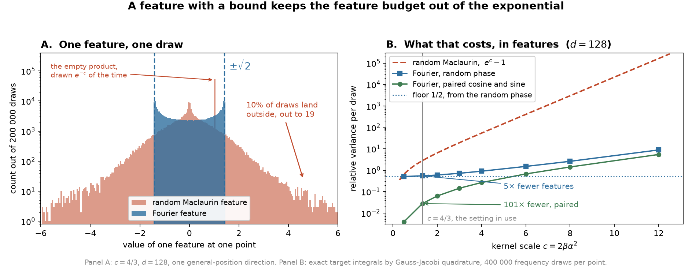

# Random Fourier features: what they are, why the budget stays small, where they lose

The Lean proofs are in `WristbandLossProofs/Fourier/`. §4 maps this note to them. **The branch
has no axioms**: the draw law is built explicitly and the identity is proved, so an
implementation can be checked against the proof line by line. The scripts beside this file
produce every measured number below: `variance_check.py` and `fig_bounded.py`.

Related documents:

- [`poisson_mode_sampling.md`](../poisson/poisson_mode_sampling.md) — the other sampling
  estimator, and the source of every number in §1.2.
- [`spectral_guide.md`](../spectral/spectral_guide.md) — the harmonic estimator of §1.1. That
  guide states that its own Lean files do not compile against the pinned Mathlib, so its
  "Proved" labels are not a current machine check.

This note is about the **angular** factor of the wristband kernel. Six exact cosine modes
handle the radial factor. They keep $99.999\%$ of the radial weight, so the radial factor is
not the problem.

This note describes a third way to compute the angular energy in time linear in the batch. The
first way truncates the harmonic expansion, and it is blind above the cutoff. The second way
samples the exponent of a power series, and it pays an exponential price in the kernel scale.
The third way samples a frequency. Its feature has a bound, and that one fact keeps the price
out of the exponential.

---

## 0. Notation and terms

| symbol | meaning |
|---|---|
| $d$ | embedding dimension. $S^{d-1}=\{u\in\mathbb{R}^d:\lVert u\rVert=1\}$ is the unit sphere |
| $u,u'$ | two directions on $S^{d-1}$. $t:=u^\top u'\in[-1,1]$ is their cosine similarity |
| $s,s'$ | the *radial* coordinate of a wristband point, in $[0,1]$. Not the same as $t$ |
| $\beta,\alpha$ | kernel bandwidth and angular-radial balance (paper §3.1) |
| $c:=2\beta\alpha^2$ | the only parameter the angular analysis uses |
| $\omega$ | one *frequency*, a vector in $\mathbb{R}^d$ |
| $b$ | one *phase*, a number in $[0,2\pi)$ |
| $\psi_{\omega,b}$ | the Fourier feature, a function on the sphere |
| $D$ | the number of features drawn per step |
| $N$ | batch size |
| $\ell$ | *harmonic* degree. $N_\ell\approx d^\ell/\ell!$ is its multiplicity, $\lambda_\ell$ its weight |
| $m$ | *monomial* degree, the exponent of $t$. **Not** the same as $\ell$ |
| $f_k(s)=\cos(k\pi s)$, $a_k$ | the radial modes and their weights. $\bar a_0=\sqrt{\pi/\beta}$. The Poisson note writes $\rho_k$ for these; this note keeps $\rho$ for the variance below |
| $P$, $\mu_0$ | a distribution on the sphere, and the uniform target |
| $\mathcal{E}(P)$ | kernel energy $\mathbb{E}_{u,u'\sim P}[k(u,u')]$ |
| $\lambda_0$ | the angular energy at the target, $\mathcal{E}_{\mathrm{ang}}(\mu_0)$ |
| $\varphi_\sigma(r)$ | the mean of $\cos(\omega^\top u)$ over the uniform sphere, at $\lVert\omega\rVert=r$ |
| $\rho$ | *relative variance per draw*, $\mathrm{Var}[\text{one draw}]/\mathbb{E}[\text{one draw}]^2$ |
| $\varepsilon$, $\delta$ | relative standard error on the energy, and failure probability |

These terms occur below:

- **PSD** means positive semi-definite.
- A kernel is **characteristic** if distinct distributions get distinct mean embeddings.
- An estimator is **unbiased** for a quantity if its mean over the randomness equals that
  quantity exactly.
- A **U-statistic** drops the self-pairs of a batch. A **V-statistic** keeps them.

Two configurations occur below. The **neural** configuration uses $\beta=8$ and
$\alpha^2=1/12$, so $c=4/3$. The **point-cloud** configuration uses $\beta=64$ and
$\alpha=0.8$, so $c=81.9$.

Two renames from the research memo that started this work. That memo writes $\kappa$ for the
kernel scale and $M$ for the feature count. This note writes $c$ and $D$, to agree with the Lean
development and with the other notes.

---

## 1. One number, three prices

The repulsion loss reads one number from a batch: the mean kernel value over all pairs.

$$\mathcal{E}(P)\;=\;\mathbb{E}_{u,u'\sim P}\bigl[k_{\mathrm{ang}}(u,u')\bigr],
\qquad k_{\mathrm{ang}}(u,u')=e^{c(t-1)},\quad t=u^\top u' .$$

That number is smallest at the uniform measure, and only there. The gap above the minimum is
an exact distance:

$$\mathcal{E}(P)-\mathcal{E}(\mu_0)\;=\;\mathrm{MMD}^2(P,\mu_0).$$

[Technical: `energy_eq_mmdSq_of_constantPotential`. The identity needs the target to have a
constant potential, which the Neumann radial factor supplies.]

A direct calculation compares all $N^2$ pairs. At $N=4096$ that is $8.4$ million comparisons,
and the memory is $O(N^2)$. Two replacements exist that cost only $O(N)$ per feature. Each pays
a different price.

### 1.1 Truncating the harmonics is exact but blind

Expand the kernel over the patterns of the sphere. The patterns come in groups, group $\ell$
holds $N_\ell\approx d^\ell/\ell!$ of them, and all of them carry the same weight
$\lambda_\ell$. Keep groups $\ell\le1$ and six radial modes. The cost falls to $O(NdK)$.

The weight kept is a product of the row share and the column share:

| direction | what is kept | share of the weight |
|---|---|---|
| radial (columns) | six cosine modes | $99.999\%$ |
| angular (rows) | $\ell\le1$ | $61.5\%$ |
| **combined** | | $\mathbf{61.5\%}$ |

So $38.5\%$ of the angular weight is discarded at $c=4/3$. That share uses the large-$d$ form
$(1+c)e^{-c}$; the exact value at $d=128$ keeps $61.9\%$, and the two differ by $O(1/d)$.

The share is not the real problem. The real problem is that the discarded part is discarded
*exactly*. A truncated kernel has finite rank, so it is not characteristic, and a whole family
of non-uniform distributions reads as uniform:

| batch on the sphere | exact energy | energy the $\ell\le1$ loss reports |
|---|---:|---:|
| uniform on the sphere | $0.265795$ | $0.265608$ |
| uniform on a great circle | $0.394430$ | $0.265434$ |
| a two-lobed belt | $0.428306$ | $0.265434$ |
| four clusters at the corners of a square | $0.399169$ | $0.265434$ |
| one antipodal pair | $0.534742$ | $0.265434$ |

*(2048-point samples at $d=128$, $c=4/3$; the population energy of the target is $0.265434$.
The four lower rows all have mean vector exactly zero, which is the configuration an
$\ell\le1$ loss cannot see. The exact column spans $0.269$; what the truncated loss reports
spans $1.7\times10^{-4}$, smaller by a factor of $1500$. The gradient there is not merely small.
It is zero, so training cannot leave those configurations.)*

> A bias does not average out across steps. A variance does.

### 1.2 Sampling the exponent is unbiased but expensive in the scale

Write the kernel as a power series in the cosine similarity instead:

$$k_{\mathrm{ang}}(u,u')\;=\;\sum_{m=0}^{\infty}p_m\,t^m,
\qquad p_m=e^{-c}\frac{c^m}{m!} .$$

The coefficients are non-negative and they sum to one, so they are a probability distribution
over the exponent $m$. Draw $m$, then draw $m$ sign vectors $w_1,\dots,w_m$ with independent
$\pm1$ entries, and take the product of the projections:

$$\psi^{\mathrm{Mac}}(u)\;=\;\prod_{i\le m}\,w_i^\top u .$$

The mean product of two of these is the kernel exactly. No degree is invisible.

[Technical: this is the random Maclaurin feature of Kar and Karnick. In Lean it is
`randomMaclaurinFeature`, and `poissonAngularSampler_unbiased` is its unbiasedness.]

The price is variance. The relative variance of one draw at the target is

$$\rho^{\mathrm{Mac}}\;=\;e^{c}-1,
\qquad\text{so}\qquad D\;=\;\frac{e^{c}-1}{\varepsilon^{2}} .$$

At $c=4/3$ that is $\rho=2.794$, and the $D=384$ in use is the choice $\varepsilon=8.5\%$. The
rule has no $d$ in it, and no $N$. It is exponential in the kernel scale alone. At $c=4$ the
budget is $19\times$ larger. Ask for $\varepsilon\le10\%$ with $D\le10^4$, and the method runs
out at about $c=4.6$. At the point-cloud configuration $c=81.9$ it asks for $4\times10^{35}$
features.

---

## 2. A Gaussian is an average of cosines

This section builds the third estimator in six steps. Each step lands on something already
believed or checkable on the page.

### Step 1 — the kernel reads only the distance between the two points

For two unit vectors, expand the squared distance:

$$\lVert u-u'\rVert^2 \;=\; \lVert u\rVert^2-2u^\top u'+\lVert u'\rVert^2\;=\;2-2t .$$

Substitute that into the kernel:

$$k_{\mathrm{ang}}(u,u')\;=\;e^{c(t-1)}\;=\;e^{-\frac{c}{2}\lVert u-u'\rVert^{2}} .$$

The two forms are the same function. The second one shows that the kernel does not read the
two points separately. It reads only $u-u'$.

[Technical: `norm_sub_sq_sphere` and `kernelAngChordal_eq_chordalGaussian` in
`FourierPrimitives.lean`. `chordalGaussian c` is the right-hand form.]

### Step 2 — a cosine of a difference splits into two products

School trigonometry gives

$$\cos(A-B)\;=\;\cos A\,\cos B\;+\;\sin A\,\sin B .$$

Read the right-hand side as a sum of two products, each with one factor at $A$ and one at $B$.
That shape is what makes a batch mean possible: a quantity at point $i$ multiplied by the same
quantity at point $j$.

### Step 3 — a Gaussian is the average of such a cosine over a random frequency

Take one number $x$ and one random $\omega\sim N(0,c)$ in one dimension. Then

$$\mathbb{E}\,\cos(\omega x)\;=\;e^{-\frac{c}{2}x^{2}} .$$

This is the characteristic function of a Gaussian, and the average of a cosine is again a
Gaussian shape. In $d$ dimensions, with $\omega\sim N(0,cI_d)$ and any vector $\delta$,

$$\mathbb{E}\,\cos(\omega^\top\delta)\;=\;e^{-\frac{c}{2}\lVert\delta\rVert^{2}} .$$

Put $\delta=u-u'$ and compare with Step 1:

$$\boxed{\;k_{\mathrm{ang}}(u,u')\;=\;\mathbb{E}_{\omega\sim N(0,cI_d)}\,\cos\bigl(\omega^\top(u-u')\bigr).\;}$$

The kernel is an average. Nothing has been dropped and nothing has been truncated.

[Technical: this is Bochner's theorem for the Gaussian kernel. In Lean it is not imported but
computed, as `charFun_gaussianVec` and its real form `integral_cos_inner_gaussianVec`.]

### Step 4 — a random phase turns the split into one feature

Step 2 needs two features, a cosine and a sine. One random phase does the same work with a
single feature. Use the product identity

$$2\cos(A+b)\cos(B+b)\;=\;\cos(A-B)\;+\;\cos(A+B+2b),$$

and note that the second term averages to zero as $b$ runs over one period, because a cosine
integrates to zero over a whole number of periods. So define the **Fourier feature**

$$\boxed{\;\psi_{\omega,b}(u)\;=\;\sqrt2\,\cos\bigl(\omega^\top u+b\bigr),
\qquad \omega\sim N(0,cI_d),\quad b\sim\mathrm{Unif}[0,2\pi).\;}$$

Take $A=\omega^\top u$ and $B=\omega^\top u'$. The identity and Step 3 give

$$\mathbb{E}\bigl[\psi_{\omega,b}(u)\,\psi_{\omega,b}(u')\bigr]\;=\;k_{\mathrm{ang}}(u,u').$$

One real function on the sphere reproduces the kernel in the mean.

[Technical: `fourierFeature` in `FourierPrimitives.lean`. The construction is due to Rahimi and
Recht. `fourierAngularSampler_unbiased` is the Lean statement of the display above.]

### Step 5 — the square of a sum lists every pair

This is the identity that removes the $N^2$:

$$(x_1+x_2+x_3)^2\;=\;x_1^2+x_2^2+x_3^2\;+\;2x_1x_2+2x_1x_3+2x_2x_3 .$$

The right side names every pair. The left side needs one sum and one squaring. Evaluate the
feature once at each of the $N$ points, add, then square. The cost is $N$, not $N^2$.

This is the same identity that makes the harmonic path linear. Only the functions differ.

### Step 6 — the estimator

Draw $D$ independent pairs $(\omega_j,b_j)$. The estimate of the angular energy is

$$\boxed{\;\widehat{\mathcal{E}}_D
\;=\;\frac1D\sum_{j=1}^{D}\Bigl(\frac1N\sum_{i=1}^{N}\psi_{\omega_j,b_j}(u_i)\Bigr)^{\!2}.\;}$$

The inner sum is one matrix product $U\Omega^\top$ followed by a cosine, so the cost is
$O(NDd)$. No pairwise matrix is built at any point.

[Technical: `fourierRealizedAngularEnergy_featureForm` states exactly this identity in Lean,
and `fourierRealizedEnergy_unbiased` states that its mean over draws is the true energy.]

The joint kernel keeps the same shape. The radial factor has its own cosine expansion, so a
joint feature is a product $\Phi_{jk}(u,s)=\sqrt{a_k}\,\psi_{\omega_j,b_j}(u)f_k(s)$, and the
whole wristband energy becomes a sum of squared batch means over the $D\times K$ cells. The
joint form still tests the *pair* $(u,s)$, so it still detects a batch whose direction and
radius are each correct but are wrongly linked.

---

## 3. The feature has a bound, and everything follows from that

A cosine never leaves $[-1,1]$. So the Fourier feature never leaves $[-\sqrt2,\sqrt2]$, at every
point of the sphere and at every draw:

$$\lvert\psi_{\omega,b}(u)\rvert\;\le\;\sqrt2 .$$

Compare the random Maclaurin feature. It is a product of $m$ projections, $m$ is unbounded, and
each projection can be as large as $\sqrt d$. No bound exists.

*(Redraw with `fig_bounded.py`. Panel A: $c=4/3$, $d=128$, one general-position direction,
200 000 draws. The spike of the red histogram at $+1$ is the empty product, drawn $e^{-c}=26\%$
of the time. At the axis-aligned direction every Maclaurin value is exactly $\pm1$, which is
that feature's best case and not representative. Panel B: the target integrals are exact, by
Gauss-Jacobi quadrature; the frequency average uses 400 000 draws per point.)*

Panel A is the whole mechanism. $10\%$ of Maclaurin draws land outside $\pm\sqrt2$, and the
largest reaches $19$.

Four consequences follow, and each is a theorem rather than a hypothesis.

**Consequence 1 — the second moment exists, at every distribution.** A bounded function is
square-integrable against any probability measure. So the estimator's integrability condition
needs nothing from the batch. [`fourier_hasIntegrableDrawEnergy`]

**Consequence 2 — one draw's energy stays inside a fixed interval.** The angular part of the
draw kernel is a product of two features, so its size is at most two. Multiply by the radial
factor and integrate. [`fourier_drawEnergy_mem_Icc_radial`]

**Consequence 3 — one draw's energy is square-integrable.** Bounded implies $L^2$.
[`fourier_drawEnergy_memLp_two`]

**Consequence 4 — the variance has an explicit bound.** A quantity confined to an interval of
width $w$ has variance at most $(w/2)^2$. [Technical: Popoviciu's inequality,
`variance_le_sq_of_bounded` in Mathlib.] So

$$\mathrm{Var}\bigl[\text{one draw}\bigr]\;\le\;4\,\mathcal{E}_{\mathrm{rad}}(P)^2 ,$$

where $\mathcal{E}_{\mathrm{rad}}(P)$ is the energy of the radial factor alone, a quantity the
batch measures. [`fourier_drawEnergy_variance_le_radial`]

None of the four reads the draw law. They read the definition of the feature. So a change of
law cannot break them, and they held even while the law was still an axiom.

The Poisson branch proves none of the four, and two separate obstacles stand in the way. Its
feature has no bound, so no pointwise argument is available. Its law is the chosen witness of
an existence axiom, so nothing can be computed from it and no argument through the law is
available either.

> The bound is a property of the feature map alone. It never asks what the law is.

---

## 4. What the machine checks

The branch has four files and no axioms.

| file | contents |
|---|---|
| `FourierPrimitives.lean` | the draw, the feature, its bound, and two facts about the radial factor |
| `FourierLaw.lean` | the explicit draw law, and the proof that its mean feature product is the kernel |
| `FourierFoundations.lean` | unbiasedness, and the four consequences of §3 |
| `FourierEstimator.lean` | the feature count, separation, uniqueness, the Gaussian characterization |

### 4.1 The law is built, not assumed

`fourierFeature_law` proves the identity for a law written out in full:

$$\texttt{fourierFeatureLaw}\ d\ c\;=\;\underbrace{N(0,\,c\,I_d)}_{\texttt{gaussianVec}}
\;\otimes\;\underbrace{\mathrm{Unif}[0,2\pi]}_{\texttt{phaseUniform}} .$$

The frequency is assembled one coordinate at a time from Mathlib's one-dimensional Gaussian; the
phase is a scaled restriction of Lebesgue measure. There is no `choose`, so the definition is
readable end to end. That is what makes the correspondence with an implementation checkable:

| Lean | Python |
|---|---|
| `Measure.pi fun _ : Fin d => gaussianReal 0 c.toNNReal` | `w = rng.normal(0.0, sqrt(c), size=d)` |
| `phaseUniform` | `b = rng.uniform(0.0, 2*pi)` |
| `.prod` | the two are drawn independently |
| `fourierFeature` | `sqrt(2) * cos(w @ u + b)` |

The proof needed three results that Mathlib does not have. Mathlib has no Gaussian measure above
one dimension, and no cosine integral against a Gaussian at any dimension.

| Lean name | what it says |
|---|---|
| `gaussianVec` | the centred Gaussian on $\mathbb{R}^d$ with covariance $cI$, coordinatewise |
| `charFun_gaussianVec` | its characteristic function is $e^{-c\lVert t\rVert^2/2}$ |
| `integral_cos_inner_gaussianVec` | the real form, $\mathbb{E}\cos\langle w,t\rangle=e^{-c\lVert t\rVert^2/2}$ |
| `integral_cos_add_two_mul_phaseUniform` | a uniform phase averages any shifted cosine to zero |

The last one is the exact statement of why one feature does the work of a cosine and a sine
together. The first three are of use beyond this branch.

Rahimi and Recht (2007), from Bochner (1933), are the source of the estimator. The proof follows
neither: it computes the characteristic function directly. So the citation is an attribution and
not a dependency, and the earlier open question about which result number to cite no longer
affects what is proved.

### 4.2 The theorems

| Lean name | what it says | project axioms used |
|---|---|---|
| `kernelRadNeumann_le_neumannSup` | the radial factor has a bound on the unit square | none |
| `continuous_kernelRadNeumann` | the radial factor is continuous there | none |
| `charFun_gaussianVec` | the characteristic function of the frequency law | none |
| `integral_cos_inner_gaussianVec` | its real form | none |
| `integral_cos_add_two_mul_phaseUniform` | the phase averages a shifted cosine to zero | none |
| `fourierFeature_law` | the mean feature product is the chordal Gaussian | none |
| `fourierAngularSampler_unbiased` | the mean feature product is the angular kernel | none |
| `fourier_hasIntegrableDrawEnergy` | the draw kernel is integrable, at every $P$ | none |
| `fourier_drawEnergy_memLp_two` | one draw's energy is square-integrable | none |
| `fourier_drawEnergy_variance_le_radial` | its variance is at most $4\,\mathcal{E}_{\mathrm{rad}}(P)^2$ | none |
| `fourierRealizedEnergy_unbiased` | the $D$-feature estimate has the true energy as its mean | none |
| `fourierFeatureCount_suffices_radial` | how many features hold the estimate within $\varepsilon$ | none |
| `fourierRealizedEnergy_separates` | the loss ranks two distributions in the right order | none |
| `fourierRealizedAngularEnergy_featureForm` | the energy is a mean of squared batch means | none |
| `fourierSampledEnergy_minimizer_unique` | the uniform measure is the only minimizer | 6 |
| `fourierSampledEnergy_wristband_gaussian_iff` | the minimum sits exactly at the Gaussian | 9 |

*(Counts are from `#print axioms`, excluding `propext`, `Classical.choice` and `Quot.sound`.
The branch has no axioms of its own. The last two rows inherit the kernel-branch and
equivalence-branch axioms, because they speak about the wristband and the Gaussian rather than
about the estimator. No declaration in the branch uses `sorry`.)*

The two radial facts also touch a gap elsewhere.
`measurable_wristbandKernelNeumann` is one of the four open `sorry`s of the kernel branch, and
continuity supplies its main step, because a continuous function is measurable. That statement
carries no sign condition on $\beta$, so closing it needs one more case: at $\beta\le0$ the
image sum is not summable, `tsum` returns zero, and a constant is measurable.

### 4.3 What the branch removes from the caller

This is the concrete difference against the Poisson branch. `featureCount_suffices` is generic:
it holds for any unbiased sampler, and it asks the caller for four inputs.

| input to `featureCount_suffices` | Poisson branch | Fourier branch |
|---|---|---|
| unbiasedness | theorem, from its axiom | theorem, from an explicit law |
| draw kernel is integrable | **hypothesis** | theorem |
| one draw's energy is in $L^2$ | **hypothesis** | theorem |
| a variance bound $V$ | **hypothesis** | theorem, explicit constant |

The Poisson branch never instantiates `featureCount_suffices` for its own sampler, because it
cannot discharge the last three. The Fourier branch does, and the result is
`fourierFeatureCount_suffices_radial`.

### 4.4 The proved constant is loose, and by how much

Two numbers, both at $\beta=8$, $c=4/3$, $d=128$, at the uniform target.

| | value | relative to $\mathcal{E}(\mu_0)^2$ |
|---|---|---|
| proved bound $4\,\mathcal{E}_{\mathrm{rad}}(\mu_0)^2=4\bar a_0^2$ | $1.571$ | $56.8$ |
| measured variance $\rho\,\mathcal{E}(\mu_0)^2$ | $0.0150$ | $\mathbf{0.54}$ |

So the proved rule asks for about $105\times$ more features than the measurement needs. The
weaker form of the same theorem, `fourierFeatureCount_suffices`, replaces
$\mathcal{E}_{\mathrm{rad}}$ by the largest value the radial factor takes anywhere. The Lean
constant `neumannSup` equals $6.000$ at every $\beta\ge4$, and the radial factor's true
supremum on the unit square is $2.000$, so that constant is itself $3\times$ loose. Against the
*mean* $\bar a_0=0.627$ the same replacement costs $(6/0.627)^2=92\times$, so the weaker form
asks for about $9600\times$ more features than the measurement needs.

The reason is that Popoviciu reads only the extreme value the draw energy could take. It does
not read the spread. Closing most of the remaining gap needs one more fact: that the draw
energy is never negative. That holds, because the draw kernel is a rank-one kernel multiplied
by a positive-definite one, but it is not formalized. With it, the Bhatia-Davis form gives
$(2\mathcal{E}_{\mathrm{rad}}-\mathcal{E})\mathcal{E}$, which is $6.5$ in the units of the table
above rather than $56.8$.

> **Label the two tiers.** The bound $4\mathcal{E}_{\mathrm{rad}}(P)^2$ is machine-checked. The
> value $\rho\approx0.54$ is measured, and the law $\rho\approx\frac32e^{2c^2/d}-1$ below is
> analytic. Do not quote the second as a proved constant.

---

## 5. The numbers

All measured values come from `variance_check.py`. The target integrals use Gauss-Jacobi
quadrature, so the dimension costs nothing and no batch enters.

### 5.1 The relative variance per draw

$$\rho\;=\;\frac{\mathrm{Var}[\text{one draw}]}{\mathbb{E}[\text{one draw}]^2},
\qquad D\;=\;\frac{\rho}{\varepsilon^{2}} .$$

At $d=128$, at the uniform target:

| $c$ | Fourier, random phase | Fourier, paired | $\frac32e^{2c^2/d}-1$ | random Maclaurin, $e^c-1$ | ratio to the random-phase feature |
|---:|---:|---:|---:|---:|---:|
| $0.5$ | $0.5065$ | $0.00389$ | $0.5059$ | $0.6487$ | $1.3$ |
| $\mathbf{4/3}$ | $\mathbf{0.5405}$ | $\mathbf{0.02766}$ | $0.5423$ | $\mathbf{2.794}$ | $\mathbf{5.2}$ |
| $2$ | $0.5925$ | $0.06245$ | $0.5967$ | $6.389$ | $10.8$ |
| $3$ | $0.7145$ | $0.14366$ | $0.7265$ | $19.09$ | $26.7$ |
| $4$ | $0.8951$ | $0.26382$ | $0.9260$ | $53.6$ | $59.9$ |
| $6$ | $1.4968$ | $0.66720$ | $1.6326$ | $402.4$ | $269$ |
| $8$ | $2.5900$ | $1.40998$ | $3.0774$ | $2980$ | $1151$ |
| $12$ | $8.7916$ | $5.39821$ | $13.2316$ | $1.63\times10^{5}$ | $1.85\times10^{4}$ |

Three readings.

**The feature budget is not exponential in $c$.** It follows $\frac32e^{2c^2/d}-1$ closely while
$c^2/d$ stays small. That column matches the measurement to within $1\%$ at $c\le2$, to $4\%$
at $c=4$, and it drifts above that. The approximation replaces the target characteristic
function by a Gaussian, and that replacement fails once $c$ approaches $d/2$. At $c=81.9$,
$d=128$ the approximation is wrong by 40 orders of magnitude, while the measured value is
$1.8\times10^{5}$. Use the measurement, not the formula, outside $c\lesssim\sqrt{d}/2$.

**The dimension helps.** The exponent carries $c^2/d$, so at a fixed kernel scale the cost of a
feature *falls* as the embedding grows. The Maclaurin rule $e^c-1$ has no $d$ in it at all. At
$d=32$ the same measurement gives $0.661$ at $c=4/3$ instead of $0.541$.

**The random phase costs a fixed factor.** The two Fourier columns satisfy an exact relation.
Write $\varphi_P(\omega)$ for the mean of $e^{i\omega^\top u}$ over $P$, which at the target is
the $\varphi_\sigma$ of the notation table. Then

$$\rho_{\text{phase}}\;=\;\tfrac32R-1,\qquad \rho_{\text{paired}}\;=\;R-1,
\qquad R:=\frac{\mathbb{E}_\omega\lvert\varphi_P\rvert^4}
{\bigl(\mathbb{E}_\omega\lvert\varphi_P\rvert^2\bigr)^2}\;\ge\;1 .$$

The factor $\frac32$ is the mean of $4\cos^4 b$ over one period. Because $R\ge1$ by Jensen, the
random-phase feature has a floor:

$$\rho_{\text{phase}}\;\ge\;\tfrac12\qquad\text{for every }P,\ \text{every }c,\ \text{every }d .$$

The paired feature has no such floor, and at $c=4/3$ it is $20\times$ quieter.

### 5.2 The variance does not depend much on the distribution

At $d=128$, $c=4/3$, batch $2048$, using the random-phase feature:

| configuration | exact energy | sampled mean | $\rho$ |
|---|---:|---:|---:|
| uniform | $0.265785$ | $0.265779$ | $0.541\pm0.010$ |
| antipodal pairs | $0.265691$ | $0.264161$ | $0.547\pm0.010$ |
| collapse onto 8 of 128 dimensions | $0.294571$ | $0.293811$ | $1.041\pm0.019$ |
| one axis stretched $3\times$ | $0.266601$ | $0.266976$ | $0.554\pm0.010$ |

$\rho$ is a property of the feature, not of the distribution the feature reads. It moves by a
factor of two across configurations that are far apart.

### 5.3 The estimate is unbiased

At $d=32$, batch $256$, $c=4/3$, averaging 200 000 independent features against the exact
pairwise value:

| batch | exact | sampled mean | standard error | $z$ |
|---|---:|---:|---:|---:|
| uniform | $0.273873$ | $0.272991$ | $0.000504$ | $-1.75$ |
| antipodal pairs | $0.273292$ | $0.274003$ | $0.000513$ | $+1.39$ |
| collapse onto 8 of 32 dimensions | $0.296866$ | $0.296556$ | $0.000684$ | $-0.45$ |
| one axis stretched $3\times$ | $0.279926$ | $0.280098$ | $0.000540$ | $+0.32$ |

### 5.4 Features and flops at equal accuracy

Feature counts follow $D=\rho/\varepsilon^2$. The flop model is
$O(NDd)$ for the Fourier path and $O(N(Sd+Dc))$ for the Maclaurin path, where $S$ is the number
of shared sign vectors. At $d=128$, $c=4/3$:

| $\varepsilon$ | Maclaurin $D$ | phase features | paired frequencies | Maclaurin flops / $N$ | Fourier paired flops / $N$ |
|---:|---:|---:|---:|---:|---:|
| $20\%$ | $70$ | $14$ | $1$ | $8285$ | $128$ |
| $10\%$ | $279$ | $54$ | $3$ | $8564$ | $384$ |
| $\mathbf{8.5\%}$ | $\mathbf{384}$ | $\mathbf{75}$ | $\mathbf{4}$ | $\mathbf{8704}$ | $\mathbf{512}$ |
| $1\%$ | $27\,940$ | $5405$ | $277$ | $45\,445$ | $35\,456$ |

*(The Maclaurin flop column assumes $S=64$ shared projections. That assumption is not measured
here, and a smaller $S$ moves the column. Both flop columns are a model of the operation count,
not a wall-clock measurement.)*

The paired feature wins by $17\times$ at the accuracy in use. The margin narrows at high accuracy,
because the Maclaurin feature costs $O(c)$ per feature after the shared projections, while a
Fourier feature costs $O(d)$ and cannot share. Structured or orthogonal frequency matrices reduce
that to about $O(d\log d)$ per feature.

> **Citation pending verification.** The orthogonal and structured variants are attributed from
> recollection to Yu and coauthors (2016). Neither the variance-reduction factor nor its
> validity on the sphere is checked here.

### 5.5 The self-pair term is exactly one

The feature estimate keeps the $N$ self-pairs, so it estimates the V-form. The pairwise path
drops them, so it estimates the U-form. The two differ by a known constant, because
$k_{\mathrm{ang}}(u,u)=1$ at every $u$, and the mean of $\psi_{\omega,b}(u)^2$ over the phase is
$1$ at every $u$ and every frequency. Measured at four settings, that mean is $1.000$ to within
$0.002$. So

$$\widehat{\mathcal{E}}_{\mathrm{U}}\;=\;\frac{N\,\widehat{\mathcal{E}}_{\mathrm{V}}-1}{N-1}$$

converts one to the other with no extra pass over the batch. Apply it before comparing any
feature-based number against a pairwise number.

---

## 6. Where it loses

**The random phase costs more than it saves.** §5.1 gives the exact relation and the floor
$\rho\ge\frac12$. A pair of features, a cosine and a sine at the *same* frequency, removes the
phase entirely. It costs two features per frequency instead of one, and at $c=4/3$ it is
$20\times$ quieter, so it wins by $10\times$ per feature. The Lean development formalizes the
one-feature version, because that version fits the existing sampler type without change. The
paired version needs a sampler whose feature has two components.

**The cost per feature carries the dimension.** A Maclaurin feature is a product of $m$ numbers
that already exist, at cost $O(m)$ with $\mathbb{E}[m]=c$. A Fourier feature needs its own
projection, at cost $O(d)$. The feature count is far smaller, so the product still favours the
Fourier path at the accuracy in use, but the margin closes as $\varepsilon$ falls.

**A frozen feature set is blind.** No fixed finite set of functions can separate every
distribution from the uniform one. If $\omega_1,\dots,\omega_D$ stay fixed, the encoder can
match those $D$ means and stop. The estimator is then a finite-rank kernel again, with its own
null space, exactly like the truncated harmonic loss. The draw must change at every step. This
is the same rule the Maclaurin sampler obeys, and for the same reason.

**The proved constant is loose.** §4.4 gives the size, $105\times$ in features. The measured
value is the one to plan with, and the proved one is the one to cite.

**The logarithm sits outside every theorem.** The code descends
$\beta^{-1}\log\widehat{\mathcal{E}}$, and $\log$ is concave, so the loss is biased even though
the energy is not. The bias is about $-\rho/(2D)=-\varepsilon^2/2$, and it errs toward
tolerating a collapsed batch. This is shared with every feature method and with the harmonic
one. It is not formalized.

**The point-cloud configuration is out of reach for both methods.** At $c=81.9$ the measured
$\rho$ of the random-phase feature is $1.8\times10^{5}$. That is $30$ orders of magnitude better than
$e^{c}-1$, and still far too large. The pairwise path remains the right choice there.

**The randomized Gegenbauer alternative is not evaluated here.** The research memo proposes a
second sphere-native estimator: sample a harmonic degree and a random pole, and use the
reproducing identity of the zonal polynomial. It keeps every degree, like the two methods
above, and it adds a second control knob, because the sampling law over degrees is free to
differ from the kernel's own coefficients. It is not formalized and not measured in this note.

---

## 7. What to implement

1. Use the **paired** feature: draw $\omega_j\sim N(0,cI_d)$, and use both
   $\cos(\omega_j^\top u)$ and $\sin(\omega_j^\top u)$. Per frequency,
   $\widehat A_j=\bigl(\overline{\cos}\bigr)^2+\bigl(\overline{\sin}\bigr)^2$.
2. **Redraw every step.** A fixed set is a finite-rank kernel with a null space.
3. Keep the **product** form over the wristband, one angular feature against one radial mode. Do
   not add an angular loss and a radial loss. A sum of the two marginals accepts a batch whose
   direction and radius are each correct but wrongly linked, and that batch is not Gaussian.
4. Apply the **U-form correction** $(N\widehat{\mathcal{E}}-1)/(N-1)$ before comparing against
   any pairwise number.
5. Size $D$ from $\rho/\varepsilon^2$ with $\rho$ measured at the working $(c,d)$, not from the
   proved constant. Re-measure $\rho$ if $c$ or $d$ changes.
6. Consider descending $\widehat{\mathcal{E}}$ rather than
   $\beta^{-1}\log\widehat{\mathcal{E}}$. Every theorem is about the energy, and the logarithm
   only adds the bias of §6.

---

## 8. Summary

| property | pairwise | harmonic $\ell\le1$ | random Maclaurin | **random Fourier** |
|---|---|---|---|---|
| cost per step | $O(N^2d)$ | $O(NdK)$ | $O(N(Sd+Dc))$ | $O(NDd)$ |
| linear in $N$ | no | yes | yes | yes |
| linear in $d$ | yes | no, $d^L$ | yes | yes |
| sees harmonic degree $\ell$ | all | only $\ell\le1$ | all, in the mean | all, in the mean |
| characteristic | yes | no | yes, in the mean | yes, in the mean |
| type of error | none | bias, irreducible | variance | variance |
| relative variance per draw | — | — | $e^{c}-1$ | $\approx\frac32e^{2c^2/d}-1$ |
| at $c=4/3$, $d=128$ | — | discards $38\%$ | $2.794$ | $0.541$, or $0.028$ paired |
| feature has a bound | — | — | **no** | **yes**, $\sqrt2$ |
| variance bound in Lean | — | — | **hypothesis** | **theorem** |
| fails when | $N$ is large | always, above $\ell=1$ | $c\gtrsim4.6$ | $c^2/d$ is large |

In one line. The harmonic path trades an exponential cost for an irreducible bias. The two
sampling paths trade it for a variance, and a variance averages away across steps. Between those
two, the price is set by how large one feature can be. A product of projections has no bound and
pays $e^{c}$. A cosine has the bound $\sqrt2$ and pays $e^{2c^2/d}$.

---

## References

1. Rahimi, A.; Recht, B. (2007). "Random Features for Large-Scale Kernel Machines."
   *NIPS* 2007, 1177–1184.
2. Bochner, S. (1933). "Monotone Funktionen, Stieltjessche Integrale und harmonische Analyse."
   *Math. Ann.* 108, 378–410.
3. Kar, P.; Karnick, H. (2012). "Random Feature Maps for Dot Product Kernels."
   *AISTATS* 2012, *PMLR* 22, 583–591.
4. Schoenberg, I. J. (1942). "Positive definite functions on spheres."
   *Duke Math. J.* 9, 96–108.
5. Popoviciu, T. (1935). "Sur les équations algébriques ayant toutes leurs racines réelles."
   *Mathematica* 9, 129–145.
6. Bhatia, R.; Davis, C. (2000). "A better bound on the variance."
   *Amer. Math. Monthly* 107, 353–357.

> **Citation pending verification.** Entries 1 to 3, 5 and 6 are attributed from recollection.
> Entries 5 and 6 name the two variance inequalities that Mathlib uses in
> `variance_le_sq_of_bounded` and `variance_le_sub_mul_sub`; the Mathlib docstrings give the
> names but no bibliographic detail, and the details above are not checked against the sources.
>
> Entries 1 and 2 are **attribution only**. Nothing in the Lean development depends on them:
> §4.1 proves the identity from Mathlib. An error in either citation would misattribute the
> idea; it could not falsify a theorem.
