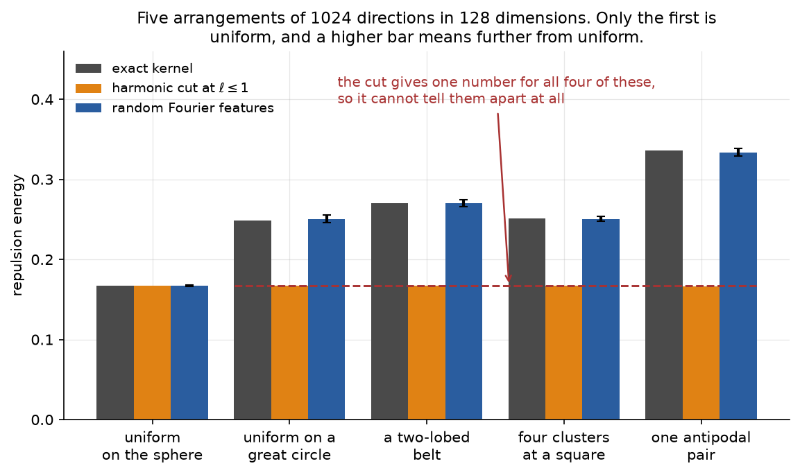
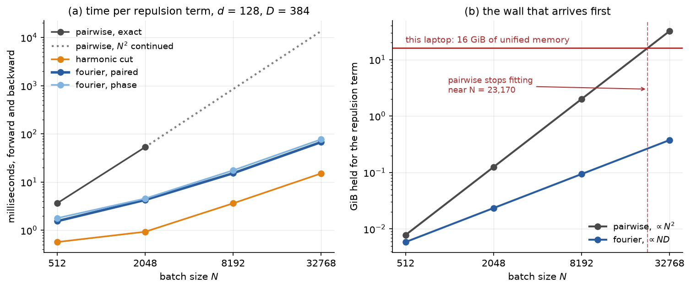
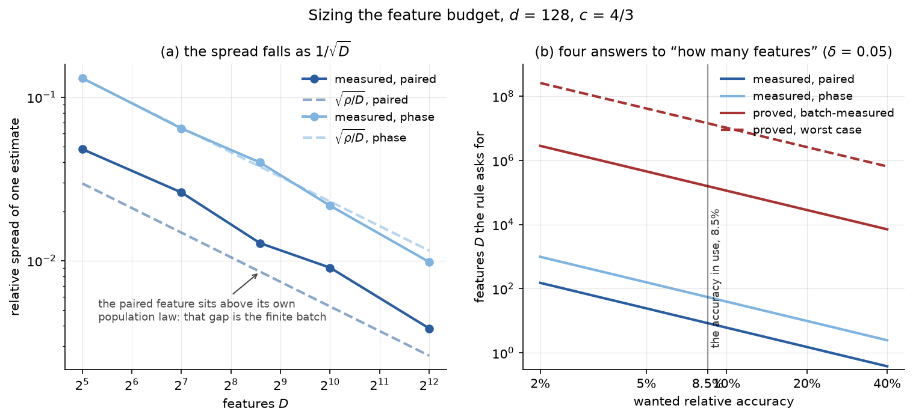
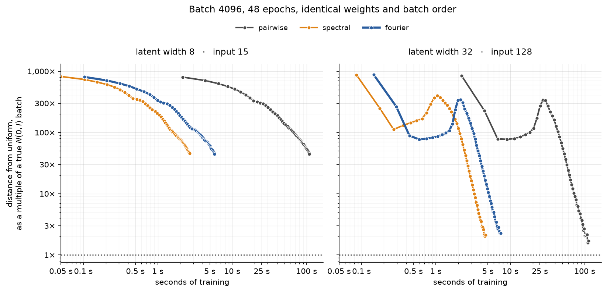
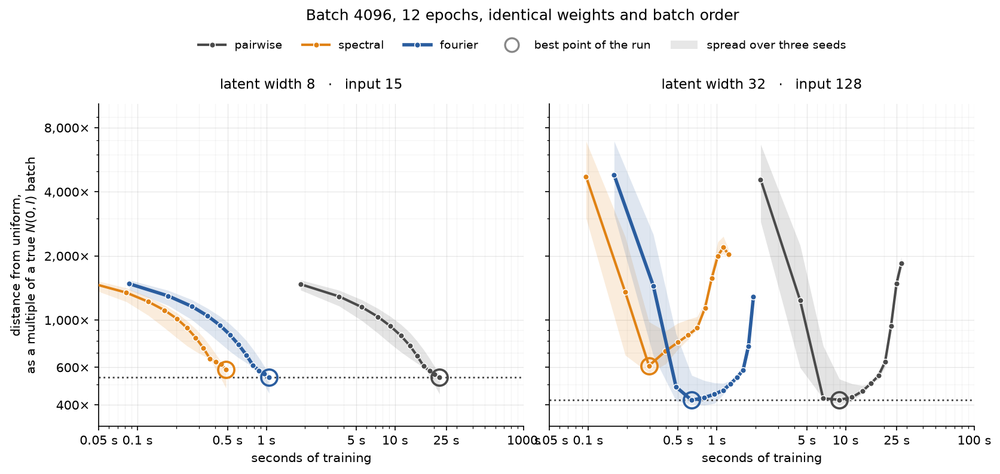

# What the measurements say

**Short answer.** The random Fourier feature path computes what it claims to, and it sees
structure the harmonic cut is blind to — the cut reports **0.7%** of a difference the features
report **95%** of. In training, that difference decides *when* a path arrives, not *where*: over
384 steps every path ends at the same quality, within the resolution of the judge, and the
features get there **14 to 19× sooner** in wall-clock. Speed is also the smaller half of the
story, because the exact kernel stops fitting in memory near a batch of 23,000 — above that it is
not slow, it is impossible. The proved feature counts hold but ask for roughly **20,000× more
features** than the paired feature actually needs, so size a run from the measurement and quote
the proof when a guarantee is wanted.

Two cautions up front. The one measured cost of the sampled path is **reconstruction**: at latent
width 32 it ends 2.4% worse than the exact kernel, on every seed. And an earlier version of §6,
kept as an appendix, reported large quality gaps between the paths — those came from stopping at
96 steps, in the middle of a transient, and they do not survive 384 steps.

---

## How to read this

Three kinds of claim appear below, and they are not interchangeable:

- **Machine-checked** — a theorem in the Lean development. Always true, no measurement involved.
- **Measured** — a number this run produced. True of this configuration; re-measure if you change
  the bandwidth `β`, the latent width `d`, or the batch size.
- **Analytic** — a formula from the written analysis, not proved and not measured here.

Where they disagree, the disagreement is stated rather than smoothed over.

**The judge.** Closeness to the target is scored three ways, and none of them is the kernel any
path trains against: an **energy distance** between the batch directions and an exact uniform
sample, a **KS distance** between the CDF-transformed radii and Uniform[0,1], and a **distance
correlation** between the two, since the target needs the direction and the radius to be
independent as well as individually right. Each is zero exactly when its property holds. Scoring
with the loss's own kernel would hand one path its objective as the exam; the mean and covariance
alone would miss everything past two moments.

**Where it ran.** Apple M2, 4 performance cores, 16 GiB unified memory, PyTorch 2.13.0 on CPU.
Sections 1 to 5 took **14 seconds** at a peak of 0.9 GB. The 384-step training runs in §6 took
**25 minutes** (690 s at width 8, 790 s at width 32) and peaked at **4.6 GB** — nearly all of it
the exact path's 4096-by-4096 tensors, which is the memory story of §3 showing up as a practical
limit rather than a plot. Most of that time is the judge, not the training: two of its three
statistics cost `O(N²)`, and it runs after every epoch.

---

## 1. The estimator computes what it claims to

Two checks, and the second is the one that can fail in an interesting way.

**The cheap form equals the expensive form.** The implementation never builds an `N`-by-`N`
matrix. It projects each point onto `D` random directions, takes a batch average per direction,
and squares. That this equals the full double sum over pairs is an identity, not an
approximation, so it must hold to the last bit of arithmetic. It does:

| variant | factored form | pairwise form | relative gap |
|---|---:|---:|---:|
| paired | 0.179597753763796 | 0.179597753763796 | 1.6e-16 |
| random phase | 0.174438767955663 | 0.174438767955663 | 0 |

[Technical: this is `fourierRealizedAngularEnergy_featureForm` in
`WristbandLossProofs/Fourier/FourierEstimator.lean:157`, checked here against
`_FourierRepulsion` in `EmbedModels.py`.]

**Averaged over draws, it lands on the right kernel.** The estimate is random — a different set
of directions gives a different number. What must be true is that the *average* over many draws
sits on the exact value. Over 400 draws on each of four differently-shaped batches, the largest
deviation was **1.74 standard errors**, which is ordinary chance.

This is the check that catches a wrong frequency scale, a wrong phase range, or a missing factor
of √2 — mistakes that leave every theorem true and every other test passing.

[Technical: the target is the exact angular kernel times the `K` radial cosines, *not* the
3-image pairwise kernel. Those are different kernels, and using the wrong one would mix "is the
sampler unbiased" with "how do the cosines compare with the reflection".]

---

## 2. The harmonic cut is blind to things the features see

This is the strongest result here, and it has nothing to do with speed.



Take 1024 directions in 128 dimensions and arrange them five ways. The first is genuinely
uniform. The other four are plainly not: all on one great circle, gathered into two opposite
lobes, gathered into four clusters, or collapsed onto a single pair of opposite points.

The exact kernel tells them apart — the energies run from 0.248 to 0.336. **The harmonic cut
returns essentially one number for all four**, between 0.16669 and 0.16732. Across those four
arrangements it reports 0.7% of the difference that is actually there. The features report 95%.

Here is the reason, and it is short enough to check on the page. Cutting the spherical-harmonic
series at degree one leaves exactly two terms: a constant, and something proportional to the
squared length of the *mean* direction of the batch. Every one of those four arrangements has
mean direction zero — a great circle averages to the centre, opposite lobes cancel, four
symmetric clusters cancel, and an antipodal pair cancels. So the second term is zero for all of
them and only the constant remains.

The important word is **bias**, not noise. Training longer does not fix this. The gradient is
identical too, so a batch sitting in one of those arrangements receives no push away from it.

[Technical: `TestFourierSeesWhatSpectralCannot`. The `ℓ ≤ 1` energy of any distribution on
`S^{d−1}` is `A₀ + A₁‖E[u]‖²`; see `docs/posts/poisson/blind_check.py`. The radii are shuffled
against the directions, so the degree-1 term is not handed a spurious correlation.]

---

## 3. The cost is real, but the memory wall arrives first



At `d = 128` and `D = 384` features, forward plus backward, in milliseconds:

| batch `N` | pairwise, exact | harmonic cut | fourier, paired | fourier, phase |
|---:|---:|---:|---:|---:|
| 512 | 3.63 | 0.57 | 1.55 | 1.78 |
| 2048 | 53.13 | 0.93 | **4.26** | 4.55 |
| 8192 | *does not fit* | 3.62 | 15.27 | 17.52 |
| 32768 | *does not fit* | 15.11 | 67.57 | 76.98 |

At a batch of 2048 the paired feature is **12.5× faster** than the exact kernel. The harmonic cut
is faster still, at 57×, which is exactly what you would expect: it keeps six radial modes and
two harmonic degrees, where the features keep 384 directions. **The cut buys its speed with the
blindness of §2.** That is the trade, stated plainly.

The right-hand panel is the part that changes the decision. The exact kernel holds several
`N × N` tensors through the backward pass, so its memory grows as `N²`. On this 16 GiB machine it
stops fitting near a batch of **23,170**. The feature paths grow as `N × D`, which is linear — at
a batch of 32,768 they hold under half a gigabyte.

So above about 20,000 points the exact kernel is not slow. It cannot be run. If large batches
matter to you — and for distribution matching they do, because the estimate itself improves with
batch — that is the argument, not the 12.5×.

---

## 4. How many features you actually need



The estimate's spread falls as `1/√D`, which panel (a) confirms across a 128-fold range of `D`.
Turning that into a budget: to hold the energy to a relative error `ε`, take `D = ρ/ε²`, where `ρ`
is the relative variance of a single feature.

At the accuracy the project uses, **8.5%**, the four rules give:

| rule | features asked for | status |
|---|---:|---|
| measured, paired | **8** | measured on this batch |
| measured, random phase | **55** | measured on this batch |
| proved, batch-measured constant | 157,329 | machine-checked |
| proved, worst-case constant | 14,407,274 | machine-checked |

Both proved rules are true. Both are enormously loose, for three compounding reasons: the
variance bound is an extreme-value argument rather than an average one; the worst-case radial
constant is 6.000 where the true supremum is 2.000, and it enters squared; and the proof uses
Chebyshev's inequality, so buying 95% confidence costs a factor of 20 rather than a factor of
about 3.

**Practical rule: size `D` from the measurement, quote the proof for the guarantee.** They answer
different questions. The proved rule is the one that cannot be wrong; the measured rule is the one
that fits in a training loop.

**The paired feature is the one to use.** It uses a cosine and a sine at each frequency instead of
one cosine with a random phase, which removes the phase term rather than averaging it away:

| latent width `d` | ρ, paired | ρ, random phase | ratio |
|---:|---:|---:|---:|
| 32 | 0.220 | 0.720 | 3.3× |
| 128 | 0.063 | 0.647 | **10.3×** |

The margin grows with the latent width, and it costs half as many projections per feature into the
bargain.

---

## 5. The gradient points the right way, except where there is nothing to point at

Against the exact path, on structured batches at `D = 1024`:

| variant | `d` | correlation of values | mean gradient cosine | worst gradient cosine |
|---|---:|---:|---:|---:|
| paired | 32 | 0.993 | 0.898 | 0.352 |
| paired | 128 | 0.999 | 0.867 | 0.193 |
| phase | 128 | 0.986 | 0.865 | 0.193 |

The values track the exact path almost perfectly. The gradients agree on average but not always:
on one batch the sampled direction was nearly uncorrelated with the exact one.

That worst case is the sampling noise doing what sampling noise does, and it lands hardest where
the true gradient is *weakest* — on a batch that is already near uniform there is little signal
for the noise to sit beside. It matters less than it looks, because the draw is refreshed every
step and the noise averages out over a training run, while a bias does not. But it is the honest
counterweight to §2: **the cut gives a steadier gradient pointing at the wrong optimum; the
features give a noisier gradient pointing at the right one.**

---

## 6. In training, the paths separate early and arrive at the same place



*Each line is the median of three seeds; the spread across them is not drawn, and the table below
reports it as standard errors instead. The vertical axis is the angular score as a multiple of
what a true `N(0, I)` batch of the same width scores — precisely, the 95th percentile of that
score over 32 genuine draws. At the dotted line, `1×`, the judge can no longer tell the batch from
a real Gaussian one. Those 32 draws use their own fixed seed, so the scale means the same thing in
every run. The figure draws the paired feature only; the random phase variant tracks it too
closely to separate by eye.*

### What the run does

An MLP autoencoder learns 40,960 points from a five-cluster, skewed, correlated mixture. The
objective is `MSE + wristband`, with both weights at 1. Only the repulsion changes between runs.

| | |
|---|---|
| shapes | input 15 → latent 8, and input 128 → latent 32 |
| loss terms | `wristband = rep + 0.1·rad + 1.0·mom`, each z-scored by calibration; the angular term is off (`lambda_ang = 0`); the paths differ in `rep` alone |
| steps | batch 4096, 8 steps per epoch, 48 epochs, 384 steps in total |
| optimiser | Adam, learning rate 3e-4 |
| paths | pairwise; spectral at `ℓ ≤ 1`; fourier at `D = 384`; all with `K = 6` radial modes |
| repeats | 3 seeds; inside a seed, all paths get the same initial weights and the same batch order |
| scale | one shared calibration, so no path gets a weaker signal |
| judge | a held-out batch of 4096, scored after every epoch by energy distance (direction), KS (radius) and distance correlation (the two together) — no path trains against any of them |

`D` was **not** tuned. It is held at the default 384 at both widths, so this run measures the
default, not the best the feature path can do.

**Is the loss in charge?** If the network takes most of the step, the timings report the network.

| | pairwise | spectral | fourier |
|---|---:|---:|---:|
| latent width 8 | 98.9% | 41.0% | 74.4% |
| latent width 32 | 96.7% | **24.2%** | 51.6% |

Only the bold figure is under a third, so the spectral timing at width 32 reports the MLP in part.

### Results after 384 steps

Median of three seeds, at the last epoch. The angular column is a multiple of what a true `N(0, I)`
batch scores, so `1.0` means "indistinguishable from one".

| | seconds/epoch | speedup | angular | radial KS | recon MSE |
|---|---:|---:|---:|---:|---:|
| **latent width 8** | | | | | |
| pairwise | 2.18 | 1.0× | 44.6× | 0.106 | 0.233 |
| spectral | 0.05 | **46×** | 45.3× | 0.105 | 0.232 |
| fourier, paired | 0.12 | **19×** | 44.6× | 0.106 | 0.234 |
| **latent width 32** | | | | | |
| pairwise | 2.36 | 1.0× | **1.7×** | 0.084 | 0.638 |
| spectral | 0.10 | 23× | 2.1× | 0.082 | 0.639 |
| fourier, paired | 0.16 | **14×** | 2.3× | 0.084 | **0.654** |

Each path is also compared with pairwise *on the same seed*, which is the test that matters with
three seeds. Reading it as "how many standard errors, and how many of the three seeds agree":

| difference from pairwise | angular | radial | reconstruction |
|---|---|---|---|
| spectral, width 8 | 1.6 σ, 1 of 3 | 0.9 σ, 2 of 3 | 1.5 σ, 3 of 3 |
| fourier, width 8 | 1.2 σ, 0 of 3 | 0.7 σ, 1 of 3 | 1.0 σ, 1 of 3 |
| spectral, width 32 | 1.1 σ, 1 of 3 | **4.2 σ, 3 of 3** *(better)* | 0.4 σ, 1 of 3 |
| fourier, width 32 | 2.0 σ, 1 of 3 | 0.2 σ, 1 of 3 | **5.4 σ, 0 of 3** *(worse)* |

Three results:

- **On quality, the paths are hard to tell apart at the end.** Only two of the twelve comparisons
  clear both bars. The spectral path is *better* on the radius at width 32, and the fourier path
  is worse on reconstruction.
- **The one consistent cost of sampling is reconstruction**: `+0.0155` at width 32, or +2.4%, at
  5.4 standard errors with all three seeds agreeing. The noisy gradient is paid for in the other
  term of the objective, not in the distribution.
- **The speed advantage is unchanged and is the durable result.** Fourier reaches the score all
  three paths reach **19× sooner** at width 8 (5.8 s against 109 s) and **14× sooner** at width 32
  (7.2 s against 100 s).

### Why the score gets worse, and then better again

The right panel rises between epoch 4 and epoch 13, and this is the whole reason the earlier
version of this section drew the wrong conclusion.

Read the angular score beside the radial one, at width 32, median of three seeds:

| epoch | 4 | 9 | 11 | **12** | 13 | 17 | 24 | 32 | 48 |
|---|---:|---:|---:|---:|---:|---:|---:|---:|---:|
| angular (× a true `N(0, I)` batch) | 78 | 117 | 272 | **339** | 332 | 160 | 36 | 9 | **1.7** |
| radial KS | 1.000 | 0.997 | 0.732 | **0.504** | 0.279 | 0.192 | 0.144 | 0.103 | 0.088 |

For the first nine epochs the radial KS sits at its worst possible value of 1.0: the model makes
the directions uniform and does not touch the radii. When the radii finally move, the directions
are wrecked and the angular score climbs five-fold. By epoch 14 the reorganisation is over, and
from there both improve together for 34 more epochs.

So the rise is a **transient**, not a trade the model settles into. **The 96-step run stopped at
epoch 12 — at the peak of that transient.** In the right panel of the figure that is the top of
the hump, a little past 1 second for the feature paths and near 25 seconds for pairwise. Every
quality gap the earlier section reported was measured there.

Width 8 shows no rise. There the radial KS falls slowly from the first epoch, so the two halves
move together and nothing has to be undone.

### How close to a real Gaussian does it get?

Close, at width 32, and not close at width 8:

- **Width 32 arrives.** All paths finish between `1.7×` and `2.3×` a true `N(0, I)` batch. At that scale
  the differences between paths are near the resolution of the judge, whose own spread is
  `1.5e-4` against gaps of about `1e-4`.
- **Width 8 does not.** It finishes at `44.6×`, still falling at the last epoch with no sign of
  flattening. It is not converged; it needs more steps, not a different loss.

The two widths sit at different points of the same trade-off, and the objective weights decide
where: width 8 ends with good reconstruction (MSE 0.233) and a latent far from Gaussian, width 32
with a nearly Gaussian latent and much worse reconstruction (MSE 0.638). The 128 → 32 task is the
harder compression, so this is expected rather than surprising.

### Two limits

*Three seeds is a small sample*, which is why the table above reports standard errors and seed
agreement rather than percentage gaps. A difference at 1 to 2 standard errors with one seed
agreeing is not a result.

*`D = 384` is a default, not a choice.* The fourier path is the only one carrying a tunable
accuracy knob here, and it was left at its default at both latent widths. The +2.4% reconstruction
cost at width 32 is the natural place to spend more features, and that is not yet measured.

---

## What this does not settle

**A number that does not match, and I could not explain it.** The written analysis gives
`ρ_paired ≈ 0.028` at `d = 128`; this run measures 0.047 to 0.087. The random-phase value agrees
well (0.54 analytic against 0.39–0.66 measured), so whatever the cause is, it affects only the
quiet variant. I guessed it was a finite-batch effect and checked, and the guess was wrong — `ρ`
does not fall with batch size:

| batch | 256 | 1024 | 4096 | 16384 |
|---|---:|---:|---:|---:|
| ρ, paired | 0.087 | 0.057 | 0.047 | 0.063 |

The most likely remaining explanation is that the published figure is for the angular factor
alone, while this measures the full wristband energy including the radial modes, and the radial
factor puts a floor under a variance that is otherwise tiny. **That is unverified.** In the
meantime the practical answer does not change: measure `ρ` at your own configuration.

**The proved bounds are about a different radial kernel.** Every theorem is stated for the full
Neumann image sum; the Python pairwise path keeps three images. The pointwise gap between them is
proved, but lifting that bound to the energy level is still an open `sorry`
(`KernelMinimization.lean:830`). So "the pairwise path is exact" means exact for the 3-image
kernel.

**A frozen draw breaks everything above.** All the estimator theorems are about the average over
draws. Holding the frequencies fixed makes a kernel of rank `D` with a blind set of its own —
precisely the failure §2 exists to avoid. `feature_seed` is for repeating a test, never for
training.

**The logarithm is not unbiased.** The energy estimate is; `(1/β)·log(estimate)` is not, because
`log` is concave. The offset is about `−ε²/2` and it errs toward *tolerating* a collapsed batch.
Small at these settings, and a reason to descend the energy itself where that choice exists.

---

## Reproducing this

```bash
cd ml-tidbits/python
../../.venv/bin/python tests/UniformityMetrics.py        # the judge, self-checked
../../.venv/bin/python tests/TestFourierWristband.py     # everything in §1-§5
../../.venv/bin/python tests/TestFourierTraining.py      # §6, at the default latent width 8
```

§6 runs `TestFourierTrainingRun` with `n_epochs=48`; the appendix is the same call with
`n_epochs=12`. Nothing else differs between them, and the seeds and batch order make the first
12 epochs of the long run identical to the short one — checked, largest relative difference
`0.0e+00`.

Every figure comes from `docs/posts/fourier/measured_figures.py`, which prints each number it
draws so the tables above can be checked against the plots rather than against a separate
calculation.

The §6 wide-latent column uses `in_dim=128, embed_dim=32, hidden=128`. The latent width is free,
but it has to stay below the input width: a latent at least as wide as the input lets the
autoencoder pass the input through untouched, so the reconstruction term applies no pressure and
the run measures nothing. The test refuses that shape rather than reporting it.

For the interactive version with cached results and a `full` preset for a CUDA host, see
`python/notebooks/fourier_benchmarks.ipynb`.

---

## The Fourier path, written out

Statements only, no derivations. Each is labelled **machine-checked**, **analytic** or
**measured**.

### Notation

| symbol | meaning | value here |
|---|---|---|
| $d$ | latent width | 8 or 32 |
| $N$ | batch size | 4096 |
| $D$ | number of features | 384 |
| $K$ | radial modes kept | 6, that is $k = 0,\dots,5$ |
| $\beta$ | kernel bandwidth | 8 |
| $\alpha$ | angular-to-radial balance | $\sqrt{1/12}$ |
| $c$ | frequency variance, $c = 2\beta\alpha^{2}$ | $4/3$ |
| $\sigma$ | uniform measure on $S^{d-1}$ | — |
| $\mu_{0}$ | the target, $\sigma \otimes \mathrm{Unif}[0,1]$ | — |
| $\varepsilon$ | how far the estimate may sit from the true energy, in the units of the energy itself | $0.0141$, that is $8.5\%$ of $E(\mu_{0})$ |
| $\delta$ | how often it is allowed to miss by more than that | $0.05$, so the bound holds $19$ times in $20$ |

### 1. The map and the target

For $z \in \mathbb{R}^{d}\setminus\{0\}$,

$$\Phi(z) \;=\; (u,\,t), \qquad u \;=\; \frac{z}{\lVert z\rVert} \in S^{d-1},
\qquad t \;=\; F_{\chi^{2}_{d}}\!\bigl(\lVert z\rVert^{2}\bigr) \in [0,1],$$

with $F_{\chi^{2}_{d}}$ the chi-squared CDF at $d$ degrees of freedom. The target is $\mu_{0}$,
uniform on the wristband $S^{d-1}\times[0,1]$.

**[Machine-checked]** $\;\Phi_{\#}Q = \mu_{0} \iff Q = \mathcal{N}(0,I)$.

### 2. The kernel

$$\mathcal{K}\bigl((u,t),(u',t')\bigr) \;=\; k_{\mathrm{ang}}(u,u')\; k_{\mathrm{rad}}(t,t')$$

$$k_{\mathrm{ang}}(u,u') \;=\; e^{-\beta\alpha^{2}\lVert u-u'\rVert^{2}}
\;=\; e^{\,2\beta\alpha^{2}(\langle u,u'\rangle - 1)}$$

$$k_{\mathrm{rad}}(t,t') \;=\; \sum_{n\in\mathbb{Z}}
\Bigl[\, e^{-\beta(t-t'+2n)^{2}} \;+\; e^{-\beta(t+t'+2n)^{2}} \,\Bigr]$$

$k_{\mathrm{rad}}$ is the heat kernel on $[0,1]$ with Neumann boundary conditions, written as a
sum over reflected images. The Python `pairwise` path keeps three images, $n\in\{-1,0,1\}$; every
theorem is stated for the full sum.

The energy of a distribution $P$ on the wristband:

$$E(P) \;=\; \iint \mathcal{K}(x,y)\, \mathrm{d}P(x)\, \mathrm{d}P(y)$$

**[Machine-checked]** $\;E(P) \ge E(\mu_{0})$, with equality only at $P = \mu_{0}$.

### 3. The two expansions

**Radial — exact, and kept exact.** With $f_{0}(t)=1$ and $f_{k}(t)=\cos(k\pi t)$,

$$k_{\mathrm{rad}}(t,t') \;=\; \sum_{k\ge 0} a_{k}\, f_{k}(t)\, f_{k}(t'),
\qquad a_{0} = \sqrt{\tfrac{\pi}{\beta}}, \qquad
a_{k} = 2\sqrt{\tfrac{\pi}{\beta}}\; e^{-k^{2}\pi^{2}/(4\beta)} .$$

At $\beta = 8$: $a_{0}=0.6267$, $a_{1}=0.9206$, $a_{2}=0.3650$, $a_{3}=0.0781$, $a_{4}=0.0090$,
$a_{5}=5.6\times10^{-4}$. The first dropped mode is $a_{6}=1.9\times10^{-5}$, which is why $K=6$
suffices.

**Angular — sampled.** With $c = 2\beta\alpha^{2}$,

$$k_{\mathrm{ang}}(u,u') \;=\; \mathbb{E}_{\omega\sim\mathcal{N}(0,\,cI)}
\bigl[\cos\langle \omega,\, u-u'\rangle\bigr].$$

### 4. The feature, and the law it is drawn from

Two forms, both unbiased for $k_{\mathrm{ang}}$.

**Random phase** — one column per draw, $\omega\sim\mathcal{N}(0,cI)$ and
$b\sim\mathrm{Unif}[0,2\pi)$ independent:

$$\psi_{\omega,b}(u) \;=\; \sqrt{2}\,\cos\bigl(\langle \omega,u\rangle + b\bigr),
\qquad \mathbb{E}\bigl[\psi(u)\,\psi(u')\bigr] \;=\; k_{\mathrm{ang}}(u,u').$$

**Paired** — two columns per frequency, so $D = 2F$ columns from $F$ draws, and no phase:

$$\varphi_{\omega}(u) \;=\; \bigl(\sqrt{2}\cos\langle\omega,u\rangle,\;
\sqrt{2}\sin\langle\omega,u\rangle\bigr), \qquad
\frac{1}{D}\sum_{j=1}^{D}\varphi_{j}(u)\,\varphi_{j}(u') \;\longrightarrow\;
k_{\mathrm{ang}}(u,u').$$

The paired form is the default: it removes the phase, which contributes variance and no
information. Both satisfy $\lvert\psi\rvert \le \sqrt{2}$, and that bound — not the law — is what
every variance result rests on.

**[Machine-checked]** the draw law is $\mathcal{N}(0,cI)\otimes\mathrm{Unif}[0,2\pi)$, built
explicitly rather than assumed; the branch has no axioms.

### 5. The estimator, and the algorithm

Draw $\omega_{1},\dots,\omega_{D}$ afresh at every step. For a batch
$\{(u_{i},t_{i})\}_{i=1}^{N}$,

$$c_{jk} \;=\; \frac{1}{N}\sum_{i=1}^{N} \psi_{j}(u_{i})\,\cos(k\pi t_{i}),
\qquad j \le D,\; k < K,$$

$$\boxed{\;\hat{E} \;=\; \frac{1}{D}\sum_{j=1}^{D}\;\sum_{k=0}^{K-1} a_{k}\, c_{jk}^{2}\;}$$

One training step:

1. $u_{i},t_{i} \leftarrow \Phi(z_{i})$ — shape $N\times d$
2. $\omega_{1},\dots,\omega_{D} \sim \mathcal{N}(0,cI)$, a fresh draw — shape $D\times d$
3. $\Psi_{ij} \leftarrow \psi_{j}(u_{i})$ — shape $N\times D$
4. $C_{ik} \leftarrow \cos(k\pi t_{i})$ — shape $N\times K$
5. $c_{jk} \leftarrow \tfrac{1}{N}\,(\Psi^{\mathsf{T}}C)_{jk}$ — shape $D\times K$
6. $\hat{E} \leftarrow \tfrac{1}{D}\sum_{j,k} a_{k}c_{jk}^{2}$ — a scalar
7. $\mathrm{loss} \leftarrow \dfrac{1}{\beta}\log\dfrac{\hat{E}}{\lambda_{0}a_{0}}$

Cost $O(NDd + NDK)$ in time and $O(ND)$ in memory. No $N\times N$ object is formed.

$\lambda_{0}$ is the degree-zero angular eigenvalue, so that $\lambda_{0}a_{0} = E(\mu_{0})$ and
the loss vanishes at the target:

$$\lambda_{\ell} \;=\; \Gamma(\nu+1)\left(\frac{2}{c}\right)^{\nu} I_{\ell+\nu}(c)\, e^{-c},
\qquad \nu = \frac{d-2}{2},$$

with $I$ the modified Bessel function of the first kind.

**[Machine-checked]** the factored form in step 6 equals the double sum over all $N^{2}$ pairs of
the sampled kernel. It is an identity, not an approximation.

### 6. What is guaranteed

Write $\hat{E}_{\omega}(P)$ for the estimate from a draw set $\omega$, and $E(P)$ for the true
energy. Two numbers you choose before sizing $D$:

- $\varepsilon > 0$ is the **tolerance** — how far the estimate may sit from the true energy. It
  is an absolute quantity in the same units as the energy, so a relative accuracy has to be turned
  into one: $8.5\%$ of $E(\mu_{0}) = 0.1663$ is $\varepsilon = 0.0141$.
- $\delta \in (0,1)$ is the **failure probability** — how often a draw is allowed to miss by more
  than $\varepsilon$. At $\delta = 0.05$ the guarantee holds for 19 draw sets in 20.

Tightening either costs features: $D$ grows as $1/\varepsilon^{2}$ and as $1/\delta$. All six
rows below are machine-checked.

| | statement |
|---|---|
| unbiased | $\mathbb{E}_{\omega}\bigl[\hat{E}_{\omega}(P)\bigr] = E(P)$ |
| feature count, worst case | $D \ge \dfrac{4\,(\sup k_{\mathrm{rad}})^{2}}{\delta\,\varepsilon^{2}} \;\Longrightarrow\; \mathbb{P}\Bigl(\bigl\lvert \hat{E}_{\omega}(P)-E(P)\bigr\rvert \ge \varepsilon\Bigr) \le \delta$ |
| feature count, batch-measured | the same with $\mathrm{radialEnergy}(\beta,P)$ in place of $\sup k_{\mathrm{rad}}$ |
| ranking | if $E(P)-E(Q) > 2\varepsilon$ and $D$ meets the bound, the estimate orders $P$ and $Q$ the same way |
| minimiser | the sampled energy has a unique minimiser, and it is $\mu_{0}$ |
| characterisation | that minimiser is reached exactly when the latent law is $\mathcal{N}(0,I)$ |

The supremum is bounded by

$$\sup k_{\mathrm{rad}} \;\le\; \mathrm{neumannSup}(\beta) \;=\; 2\sum_{n\in\mathbb{Z}}
\Bigl[\, e^{-\beta(2-2n)^{2}} + e^{-\beta(-2-2n)^{2}} + e^{-\beta(2n)^{2}} \,\Bigr],$$

which is $6.000$ at $\beta = 8$, against a true supremum of $2.000$.

Both count rules come from Chebyshev's inequality, so confidence costs $1/\delta$ and not
$\log(1/\delta)$. That is the main reason they are loose.

### 7. What the counts ask for, against what works

At $d = 128$, on a measured batch, asking for the estimate to land within $8.5\%$ of
$E(\mu_{0}) = 0.1663$ — that is $\varepsilon = 0.0141$ — on at least 19 draw sets in 20, so
$\delta = 0.05$:

| rule | $D$ | status |
|---|---:|---|
| proved, worst case | 14,407,274 | machine-checked |
| proved, batch-measured | 157,329 | machine-checked |
| analytic, $\rho/\varepsilon^{2}$, random phase | 75 | analytic |
| analytic, $\rho/\varepsilon^{2}$, paired | 4 | analytic |
| measured, paired | 8 | measured |

The relative variance falls as $1/D$:

$$\frac{\operatorname{Var}\bigl(\hat{E}\bigr)}{E^{2}} \;\approx\; \frac{\rho}{D},
\qquad \rho_{\text{phase}} \;\approx\; \tfrac{3}{2}\,e^{2c^{2}/d} - 1 .$$

$\rho_{\text{phase}}$ agrees with measurement — $0.54$ analytic against $0.39$–$0.66$ measured.
$\rho_{\text{paired}}$ does not: the analysis gives $0.028$ and this run measures $0.047$ to
$0.087$, which the section "What this does not settle" records as unresolved. Measure $\rho$ at
your own configuration and size $D$ from it; quote the proved rule when a guarantee is needed.

**One condition on all of the above.** Every statement is about the average over draws. Freezing
$\omega$ gives a kernel of rank $D$ with a blind set of its own, and none of the six rows
survives.

---


---

## Appendix — the superseded 96-step run

This section was §6 until the runs were carried from 96 steps to 384. It is kept because its
figure and its numbers were quoted, and because the reason it was wrong is worth seeing.

**What was wrong with it.** Every path was still inside the reorganisation described in §6 at
epoch 12. The quality gaps below — the spectral path +46% at width 32, the feature paths far
worse on the radius — are all measurements taken at the peak of a transient. None of them
survives to 384 steps. The wall-clock results were not affected.

**One further defect.** The vertical axis divides by a single draw of the score of a genuine
Gaussian batch, called the "floor". The true value of that statistic is zero and the estimator is
unbiased, so the draw lands either side of zero: at width 32 it came out **negative**, and 20 of
32 null draws at width 8 are below zero. It is not a denominator. §6 uses the 95th percentile of
the 95th percentile of 32 genuine `N(0, I)` draws instead.

The 48-epoch run reproduces this one exactly over its first 12 epochs — largest relative
difference `0.0e+00` — so the two are the same run, and this is its first quarter.

### The 96-step run, as it was reported



*The vertical axis is the energy distance divided by the score a true `N(0, I)` batch of the same
width gets, because a raw energy distance at width 8 and one at width 32 are not comparable
numbers. A ring marks the best point of each run: at width 32 every path overshoots and comes back
up, so the last epoch is not the score. The figure draws the paired feature only — the random
phase variant tracks it too closely to separate by eye, and it stays in the table below.*

### What the run does

An MLP autoencoder learns 40,960 points from a five-cluster, skewed, correlated mixture. The
objective is `MSE + wristband`, with both weights at 1. Only the repulsion changes between runs.

| | |
|---|---|
| shapes | input 15 → latent 8, and input 128 → latent 32 |
| loss terms | `wristband = rep + 0.1·rad + 1.0·mom`, each z-scored by calibration; the angular term is off (`lambda_ang = 0`); the paths differ in `rep` alone |
| steps | batch 4096, 8 steps per epoch, 12 epochs, 96 steps in total |
| optimiser | Adam, learning rate 3e-4 |
| paths | pairwise; spectral at `ℓ ≤ 1`; fourier at `D = 384`; all with `K = 6` radial modes |
| repeats | 3 seeds; inside a seed, all paths get the same initial weights and the same batch order |
| scale | one shared calibration, so no path gets a weaker signal |
| judge | a held-out batch of 4096, scored after every epoch by energy distance (direction), KS (radius) and distance correlation (the two together) — no path trains against any of them |

**Is the loss in charge?** If the network takes most of the step, the timings report the network.
The measured share of a step spent inside the loss:

| | pairwise | spectral | fourier |
|---|---:|---:|---:|
| latent width 8 | 98.8% | 37.9% | 73.6% |
| latent width 32 | 96.9% | **23.4%** | 54.8% |

Only the bold figure is under a third. The spectral timing at width 32 therefore reports the MLP
in part, and the test prints a warning when this occurs.

### Results

Each path is compared with pairwise *on the same seed*. The table gives the median of the three
seeds, and the range shows how firm that is.

| | seconds/epoch | speedup | best energy distance | penalty | across three seeds |
|---|---:|---:|---:|---:|---:|
| **latent width 8** | | | | | |
| pairwise | 1.85 | 1.0× | 0.22075 | — | — |
| spectral | 0.04 | 46× | 0.24057 | +6.6% | +6.0% to +11.8% |
| fourier, paired | 0.09 | **21×** | 0.22156 | **+0.8%** | +0.4% to +0.8% |
| fourier, random phase | 0.09 | 21× | 0.22073 | −0.0% | −0.5% to +0.4% |
| **latent width 32** | | | | | |
| pairwise | 2.26 | 1.0× | 0.01588 | — | — |
| spectral | 0.10 | 23× | 0.02322 | **+46%** | +41% to +80% |
| fourier, paired | 0.16 | **14×** | 0.01532 | **+0.4%** | −4.5% to +2.5% |
| fourier, random phase | 0.17 | 13× | 0.01886 | +13% | +11% to +19% |

Three results, and the first is §2 in a training run:

- The spectral penalty grows with the latent: 6.6% at width 8, 46% at width 32. A wider sphere
  holds more of the structure that degree-1 harmonics cannot see.
- The paired feature stays within 2.5% of pairwise on every seed, at both widths.
- The features reach pairwise's best score 14 to 21× sooner in wall-clock.

### Why does the score get worse after the fourth epoch?

The plotted score measures the direction only, and the loss optimises more than the direction.
The rise starts exactly when the radius starts to move.

At width 32, the radial KS distance holds at its worst value of 1.0 for the first eight epochs of
the pairwise run. The model spends that time making the directions uniform, and the angular score
falls to 423× the floor. From epoch 9 the KS distance drops — 0.997, 0.925, 0.732, 0.504 — and the
angular score climbs over the same epochs: 637×, 940×, 1483×, 1851×. The fourier run does the
same, later: its KS distance holds at 1.0 through epoch 10, and its angular score stays below
600× over those same epochs.

So the model fixes the cheap half first, and it pays in the directions when it starts on the
radii. All three paths do this, so it is a property of the objective and not of any estimator.
Width 8 shows no rise, because there the KS distance falls slowly from the first epoch and the two
halves move together.

Early stopping at the ring is therefore the wrong lesson. At the ring the KS distance is exactly
1.0, so the radii are as wrong as they can be. The ring is the best *angular* score, not the best
model.

### Why is the best score still 400 times above a true `N(0, I)` batch?

The floor is what a true Gaussian batch of the same width scores. It is the noise of the test, so
"at the floor" means "this test cannot tell the batch from Gaussian". Three reasons the runs stay
far above it:

- **At the best angular point, only half the job is done.** The KS distance is 1.0 there.
- **The runs are short.** 96 steps in total.
- **The distance to the target is only part of what is minimised.** The wristband term shares the
  objective with `MSE` at equal weight, and `MSE` is still falling at the last epoch (1.005 →
  0.869 at width 32). Inside the wristband term, the repulsion shares with a moment penalty of
  equal weight. A latent that scores at the floor would not be the minimum of the sum.

The angular score sits at the top of its null band at every epoch of every run. No run comes near
the floor. The *ordering* and the *speed* are the results here. The absolute quality is not.

### Two limits

*Three seeds is a small sample.* The spectral penalty at width 32 came out as +41%, +46% and +80%.
The ordering held on every seed. The size of the gap did not.

*The features move through the radial half more slowly.* After the same 96 steps at width 32, the
KS distance is 0.504 for pairwise, 0.311 for spectral and 0.853 for fourier. Read with the section
above, this is the same trade-off seen twice: fourier is earlier on one trajectory, with a better
angle and a worse radius. The likely cause is that pairwise uses the 3-image radial kernel while
both feature paths use the six-mode cosine expansion, so the radial objectives are not identical.
This run does not separate that from a simple difference in gradient scale. **If you use this
loss, watch the radial metric.**
