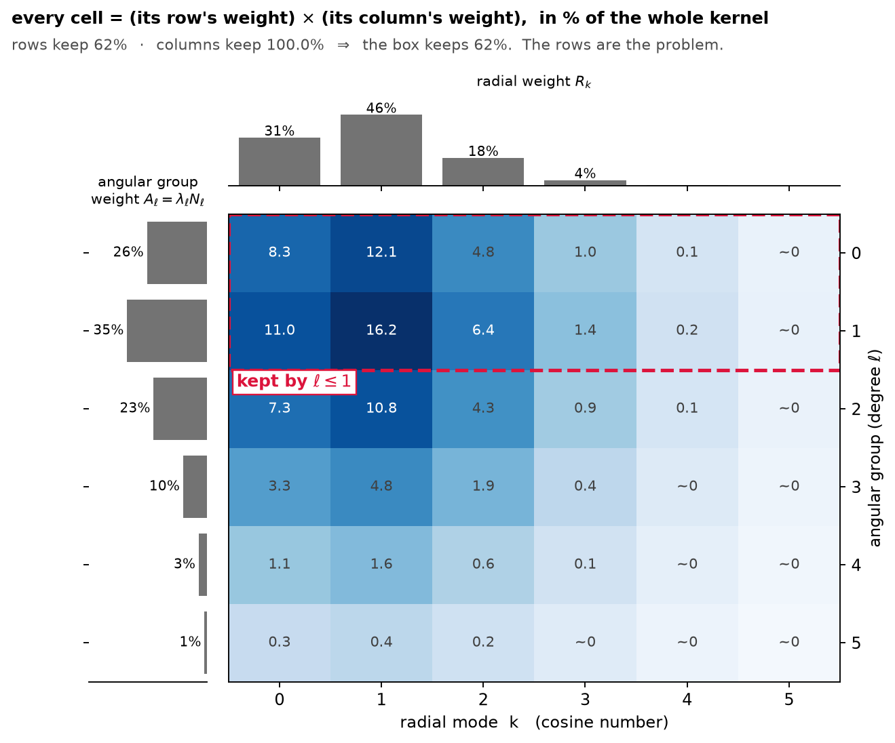
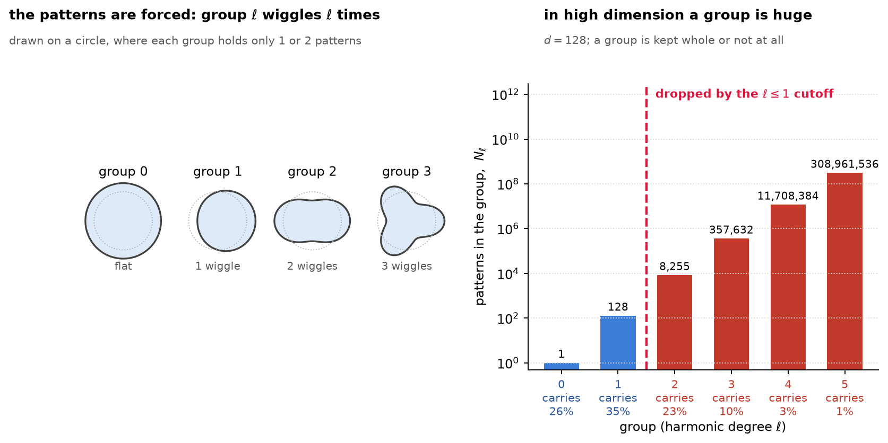
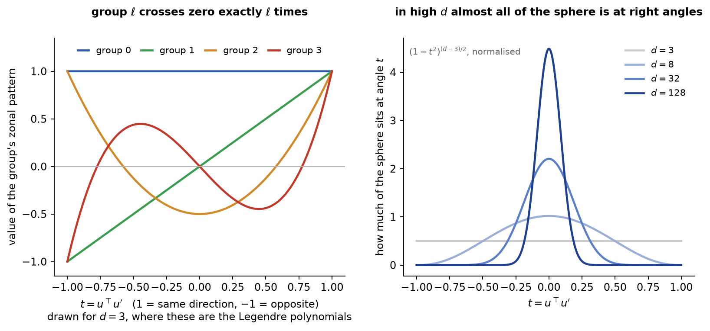
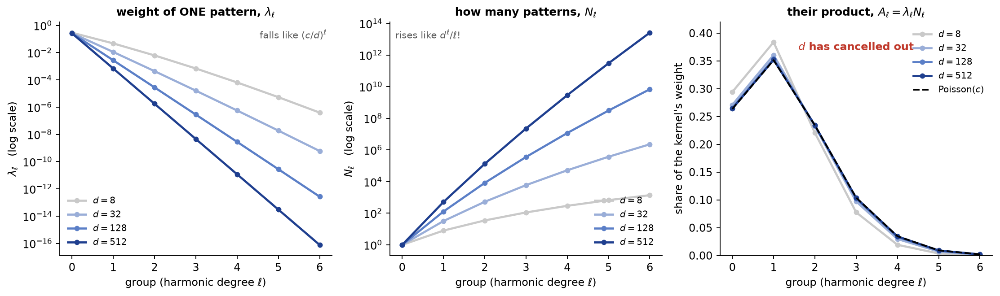
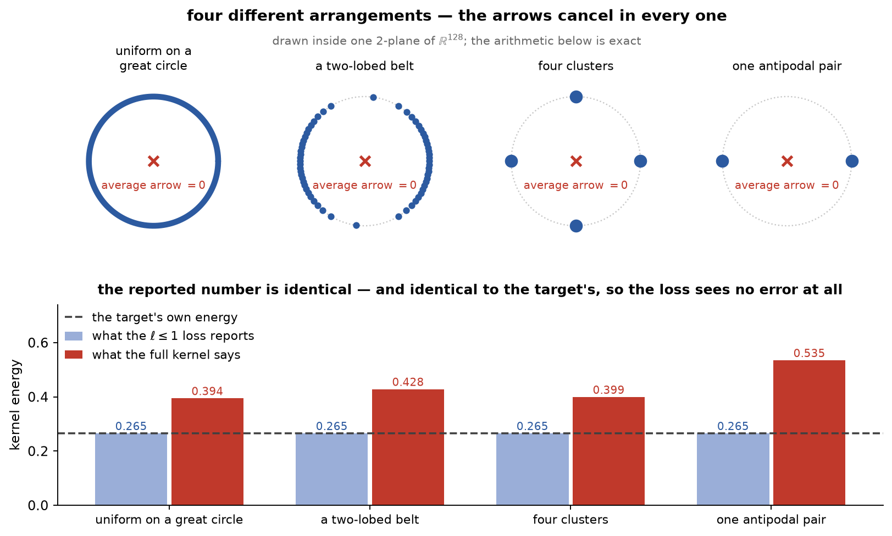
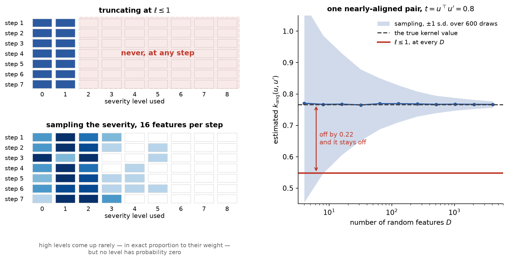

# Poisson mode sampling: what it is, why it works, where it breaks

Formalization: `WristbandLossProofs/Poisson/`, mapped section by section in
[poisson_guide.md](poisson_guide.md). Every number quoted below is produced by one of the scripts
beside this file: `bessel_check.py`, `blind_check.py`, and the `fig_*.py` that draw the figures.

Everything below concerns the **angular** factor of the wristband kernel only. The radial factor is already
handled exactly by $K=6$ cosine modes at $3\times10^{-5}$ error and is not the problem.

---

## 0. Notation and terms

| symbol | meaning |
|---|---|
| $d$ | embedding dimension; $S^{d-1}=\{u\in\mathbb{R}^d:\lVert u\rVert=1\}$ is the unit sphere |
| $u,u'$ | two directions on $S^{d-1}$; $t:=u^\top u'\in[-1,1]$ their cosine similarity |
| $s,s'$ | the *radial* coordinate of a wristband point, rescaled to $[0,1]$ (kept distinct from $t$ above) |
| $\beta,\alpha$ | kernel bandwidth and angular/radial balance (paper §3.1) |
| $c:=2\beta\alpha^2$ | the **only** parameter the angular analysis depends on |
| $\ell$ | *harmonic* degree (index of a spherical-harmonic subspace) |
| $m$ | *monomial* degree (power of $t$) — **not** the same as $\ell$; see §1 |
| $\mathcal{H}_\ell$ | space of degree-$\ell$ spherical harmonics on $S^{d-1}$ |
| $N_\ell=\dim\mathcal{H}_\ell$ | its dimension, $\sim d^\ell/\ell!$ — the *multiplicity* |
| $Y_{\ell 1},\dots,Y_{\ell N_\ell}$ | an orthonormal basis of $\mathcal{H}_\ell$ |
| $\lambda_\ell$ | the Mercer eigenvalue attached to every element of $\mathcal{H}_\ell$ (paper Eq. 13) |
| $p_m$ | the $m$-th Maclaurin coefficient of the kernel; turns out to be a Poisson mass (§1) |
| $P$, $\mu_0$ | a distribution on the sphere, and the uniform target |
| $\mathcal{E}(P)$ | kernel energy $\mathbb{E}_{u,u'\sim P}[k(u,u')]$ |
| $L$, $M$ | cutoffs: harmonic degree $\ell\le L$, monomial degree $m\le M$ |
| $N$ | batch size (number of points); $D$ = number of random features; $S$ = shared projections |

Terms used below, defined on first use: **RKHS** = reproducing-kernel Hilbert space (the space of functions
the kernel can represent); **PSD** = positive semi-definite; **characteristic** = the kernel's mean embedding
$P\mapsto\int k(\cdot,u)\,dP(u)$ is injective, i.e. distinct distributions get distinct embeddings;
**SGD** = stochastic gradient descent.

---

## 1. The kernel's forced patterns, what they cost, and why the weights are Poisson

The angular kernel (paper §3.1) is
$$k_{\mathrm{ang}}(u,u') \;=\; e^{-2\beta\alpha^2}\exp\bigl\{2\beta\alpha^2\,u^\top u'\bigr\}
\;=\; e^{-c}e^{c\,t},\qquad t=u^\top u',\quad c=2\beta\alpha^2 .$$

This section is one ladder of ten steps. Steps 1–6 work out what patterns this score is built from and why
they are ruinously expensive to store. Steps 7–10 rewrite the very same score a second way, discover that
its coefficients are a probability distribution, and explain why that is the escape route.

> ### Q. The fast method blends the direction part and the radius part into single combined "modes". So how can we then turn around and talk about the direction part on its own?
>
> **Short answer.** The blending is an ordinary **multiplication**, and anything built by multiplying two
> lists can be inspected one list at a time — the same way you can say whether a rectangle came out too
> small because it is too narrow or because it is too short.
>
> Everything below is deliberately plain. The technical name for each step is in square brackets.
>
> ---
>
> #### Step 1 — the similarity score is a product of two simpler scores
>
> Each point of the wristband has two pieces of information: **which direction** it points ($u$, a point on
> the unit sphere) and **how far out** it sits ($s$, a number rescaled into $[0,1]$).
>
> The kernel is just a *similarity score* between two points: a big number if the two points are alike, a
> small number if they are not. The wristband's score is built by multiplying a direction score by a radius
> score (paper Eq. 3):
> $$\mathcal{K}\bigl((u,s),(u',s')\bigr) \;=\; \underbrace{k_{\mathrm{ang}}(u,u')}_{\text{direction score}}\;\times\;\underbrace{k_{\mathrm{rad}}(s,s')}_{\text{radius score}}.$$
> Note what this *is not*: there is no term mixing $u$ with $s'$. The direction score never looks at a
> radius and the radius score never looks at a direction. Two students scored by
> $(\text{maths mark})\times(\text{music mark})$ — the maths mark is still a maths mark.
> [Technical: $\mathcal{K}$ is a *tensor-product kernel* on $S^{d-1}\times[0,1]$.]
>
> #### Step 2 — each score is rewritten as a weighted list of simple patterns
>
> A musical chord can be written as a sum of pure tones, each with its own loudness. Both of our scores can
> be rewritten the same way: as a weighted sum of simple patterns.
>
> * The **radius** score becomes a weighted sum of cosine waves $\rho_k(s)=\cos(k\pi s)$, with weights we
>   call $a_k$. Higher $k$ = more wiggly wave = smaller weight.
> * The **direction** score becomes a weighted sum of the sphere's own version of cosine waves. These come
>   in *groups*: group $\ell$ ("degree $\ell$") holds $N_\ell$ different patterns $Y_{\ell 1},\dots,Y_{\ell N_\ell}$
>   that all share one weight $\lambda_\ell$. Group $0$ is the flat, constant pattern ("how many points are
>   there at all"); group $1$ answers "which side of the sphere" — it is sensitive to the *average* direction;
>   group $2$ answers "along which axis are the points stretched, ignoring which end of it"; and so on, each
>   group seeing a finer feature than the last. The catch, and it matters later:
>   the group sizes explode, $N_\ell\approx d^\ell/\ell!$, so at $d=128$ group $2$ alone has about $8{,}000$
>   patterns.
>
> [Technical: each is a Mercer expansion; the $Y_{\ell r}$ are spherical harmonics and the $\lambda_\ell$
> come from the Funk–Hecke integral of Step 5 below.]
>
> #### Step 3 — multiplying the two lists gives a multiplication table
>
> Now multiply the two rewritten scores together. Multiplying two sums means "every term of the first times
> every term of the second" — you did this expanding $(a_1+a_2)(b_1+b_2)$. So the combined score is a sum
> over **every pair** (one direction pattern, one radius wave), and the weight of a pair is simply the
> product of the two weights:
> $$\text{weight of the mode } (\ell,r,k) \;=\; \lambda_\ell \times a_k .$$
> That is literally a school times-table. To draw it on one page, collect each direction *group* into a
> single row — the group $\ell$ holds $N_\ell$ patterns of weight $\lambda_\ell$ each, so the row's total
> weight is $A_\ell=\lambda_\ell N_\ell$, and the block sitting at row $\ell$, column $k$ weighs
> $A_\ell\times R_k$. Here is the real table for the paper's neural setting ($\beta=8$, $\alpha^2=1/12$, so
> $c=2\beta\alpha^2=4/3$); each cell is that block's share of the whole kernel, and the two grey bar charts
> are the row weights and column weights it was built from:
>
> 
>
> *(Redraw with `fig_mode_grid.py`. The row weights use the large-$d$ Poisson form $A_\ell=e^{-c}c^\ell/\ell!$
> of §1; the column weights are exact, $R_k \propto 2e^{-\pi^2k^2/4\beta}$ for $k\ge1$.)*
>
> [Technical: the joint eigenfunctions are the products $Y_{\ell r}\otimes\rho_k$ and the joint eigenvalues
> are $\lambda_\ell a_k$. This is `spectralEnergy` in the Lean development, whose summand is exactly
> `λv j * radialCoeff a0 a k * (modeProj j k P)^2`.]
>
> **What is that $\otimes$ actually doing?** Nothing exotic — it is ordinary multiplication of two numbers.
> The only reason it gets its own symbol is that the two things being multiplied are *functions of different
> variables*, so the result is a function of **both**:
> $$\bigl(Y_{\ell r}\otimes\rho_k\bigr)(u,s) \;:=\; Y_{\ell r}(u)\;\cdot\;\rho_k(s).$$
> $Y_{\ell r}$ only knows the direction and $\rho_k$ only knows the radius; the product is a pattern defined
> on the whole wristband. Feed it a point, it reads off the direction, reads off the radius, evaluates each
> factor separately, multiplies. That is the entire content of the symbol.
>
> The picture is again the times-table. Write the direction values down the side and the radius values across
> the top; the entry in the grid is the row value times the column value. In linear-algebra terms this is the
> outer product $\mathbf{y}\mathbf{r}^\top$ of two vectors, and $\otimes$ is the same operation written for
> functions instead of vectors.
>
> Two properties come for free and are the reason we are allowed to build a basis this way:
>
> * **The patterns stay non-overlapping.** Averaging a product over the wristband splits into two separate
>   averages, $\int\!\!\int (Y\otimes\rho)(Y'\otimes\rho') = \bigl(\int YY'\bigr)\bigl(\int\rho\rho'\bigr)$,
>   which is zero unless *both* factors match. So starting from two lists of mutually non-overlapping
>   patterns, the table of products is again mutually non-overlapping. [Technical: the tensor product of two
>   orthonormal bases is an orthonormal basis of $L^2$ on the product space.]
> * **Nothing is lost.** Every function of (direction, radius) can be written as a combination of these
>   products — the table is a complete description, not a restricted family. [Technical: $L^2(S^{d-1}\times[0,1])
>   \cong L^2(S^{d-1})\otimes L^2([0,1])$.]
>
> #### Step 4 — why the table is what makes the method fast (the "square of a sum" trick)
>
> The quantity we actually want is the average similarity between all pairs of points in a batch of $N$
> points. Done directly that means looking at every pair: about $N^2/2$ comparisons, which at $N=4096$ is
> $8.4$ million.
>
> But every cell of the table has a very special shape: it is *(something computed at point $i$)* times
> *(the same something computed at point $j$)*. And for that shape there is an identity from expanding
> brackets in school algebra:
> $$(x_1+x_2+x_3)^2 \;=\; \underbrace{x_1^2+x_2^2+x_3^2 \;+\; 2x_1x_2+2x_1x_3+2x_2x_3}_{\text{every pair appears here}} .$$
> The right-hand side lists every pair. The left-hand side is **one sum, then one squaring**. So we never
> build the pairs at all: for each cell of the table, evaluate its pattern once at each of the $N$ points,
> add the $N$ numbers, square the result. Cost $N$, not $N^2$.
>
> $$\hat c_{(\ell r),k} \;=\; \frac1N\sum_{i=1}^{N} Y_{\ell r}(u_i)\,\rho_k(s_i),
> \qquad \mathcal{E}(P)\;\approx\;\sum_{\ell,r,k}\lambda_\ell a_k\,\hat c_{(\ell r),k}^{\,2}.$$
>
> Total cost: $N \times (\text{number of cells we keep})$. **The blending in Step 3 is exactly what buys
> this.** It is not something we have to undo; it is the point.
>
> #### Step 5 — the guilty side is the one we can identify separately
>
> Two things about the table are products of a "row" number and a "column" number, and that is the whole
> answer to the question.
>
> **Cost is a product.** Number of cells kept $=$ (rows kept) $\times$ (columns kept) — the area of a
> rectangle. Keeping direction groups $\ell\le1$ and radius waves $k\le5$ at $d=128$ gives
> $129\times6=774$ cells.
>
> **Accuracy is also a product.** The share of the total weight we keep is (share of row weight kept)
> $\times$ (share of column weight kept). Read those two numbers straight off the bar charts in the figure:
>
> | side | what we keep | share of that side's weight |
> |---|---|---|
> | radius (columns) | $6$ cosine waves | $99.999\%$ |
> | direction (rows) | groups $\ell\le1$ | $61.5\%$ |
> | **combined** | the dashed box | $0.615\times0.99999 = \mathbf{61.5\%}$ |
>
> The radius side is finished. It contributes a factor of essentially $1$, and **a factor of $1$ cannot fix
> anything**: however many extra columns you add, the product is stuck at $61.5\%$. Every bit of the missing
> $38.5\%$ sits in the rows. That is why the rest of this note talks only about directions — not because we
> are ignoring the blending, but because the blending is a multiplication and we have already located which
> factor is the small one.
>
> #### Step 6 — three checks that the split is honest and not just convenient
>
> 1. **The error bound already splits by itself.** The Lean theorem
>    `spectralEnergyTruncatedByDegree_error_le_explicit` bounds the error by
>    $T_{\mathrm{ang}}(L)\cdot R_{\mathrm{tot}} + S_{\mathrm{ang}}(L)\cdot R_{\mathrm{tail}}(K)$ — a
>    "dropped a row" term plus a "kept the row, dropped a column" term. We did not impose the separation; it
>    is what the theorem says.
> 2. **"Right on average" survives the multiplication.** If we swap the rows for something random that is
>    correct *on average*, and leave the columns exactly as they are, the whole table is still correct on
>    average — because the average of (random thing) $\times$ (fixed thing) is (average of the random thing)
>    $\times$ (the fixed thing). Fixing the row side therefore fixes the product, with no further argument.
>    [Technical: $\mathbb{E}[\hat k_{\mathrm{ang}}]=k_{\mathrm{ang}}$ and $k_{\mathrm{rad}}$ deterministic
>    and independent of the draw give $\mathbb{E}[\hat k_{\mathrm{ang}}k_{\mathrm{rad}}]=\mathcal{K}$.]
> 3. **The defect survives the multiplication too.** The real failure of cutting at $\ell\le1$ (§2) is that
>    the shortened score becomes unable to *see* certain differences between distributions. A short row list
>    makes the whole table short, so that blindness is inherited by the product; and again, adding columns
>    cannot repair it. In the other direction, if both factors are rich enough the product is rich enough.
>    [Technical: finite rank of $k_{\mathrm{ang}}$ implies finite rank of $\mathcal{K}$, hence a non-trivial
>    null space of the mean embedding; conversely universality of both factors gives a characteristic
>    product, the project's `productKernel_universal_compact_imported`.]
>
> #### Step 7 — so what does the fix actually touch?
>
> Only the rows. Poisson mode sampling replaces the exact list of direction patterns with a randomly drawn,
> much shorter list that is right on average; the columns stay exactly as they are. The object is still a
> table, the counting of Step 4 is unchanged, so the method is still one number per point per cell — still
> linear in $N$. With $D$ random direction features and the same $K{+}1$ exact cosines that is $D(K{+}1)$
> cells (e.g. $384\times6=2304$), and the batch energy is the squared length of the average feature vector.
> [Technical: the joint feature is $\Phi(u,s)=\psi(u)\otimes\rho_k(s)$ and
> $\mathcal{E}\approx\lVert\overline{\Phi}\rVert^2$.]

### Steps 1–6 — the forced catalogue of patterns, and what it costs

$$k_{\mathrm{ang}}(u,u') \;=\; \sum_{\ell\ge0}\lambda_\ell\sum_{r=1}^{N_\ell}Y_{\ell r}(u)\,Y_{\ell r}(u') .$$

**What this says, before any of the symbols.** The direction score can be rebuilt out of a fixed catalogue of
patterns. We do not get to choose the catalogue — it is forced on us by the single fact that the score cares
only about the *angle* between two directions. The patterns arrive in **groups**, and group $\ell$ is "the
pattern that wiggles $\ell$ times". The whole difficulty of this note is one number: how many patterns a
group contains once $d$ is large.

*(Redraw with `fig_groups.py`. Group sizes $N_\ell$ are exact; the "carries" percentages are the large-$d$
Poisson approximation of §1 at $c=4/3$.)*

Six steps below. The numbering restarts here — it is independent of the steps inside the box above.

#### Step 1 — a similarity score is a symmetric table, and every symmetric table splits into simple pieces

Pretend for a moment there are only $1000$ possible directions rather than a whole sphere. Then
$k_{\mathrm{ang}}$ is nothing but a $1000\times1000$ table of numbers, and it is **symmetric**: the score of
$(A,B)$ equals the score of $(B,A)$, because it depends only on the angle between them and an angle has no
direction of travel.

You already know what happens to a symmetric table. It has a set of mutually perpendicular eigenvectors, and
it can be rebuilt from them:
$$A \;=\; \sum_i \lambda_i\, e_i e_i^\top, \qquad\text{entry by entry}\qquad A_{xy}=\sum_i \lambda_i\,e_i(x)\,e_i(y).$$
Read the right-hand side in words: take a pattern $e_i$ (one number for each of the $1000$ directions),
multiply its value at $x$ by its value at $y$, weight by $\lambda_i$, and add up over patterns. That is
already the shape of the expansion at the head of this section — compare the two displayed formulas, they
are the same sentence.

Going from $1000$ directions to *every* direction on the sphere changes nothing structurally: sums over the
$1000$ become integrals over the sphere, and the list of patterns is allowed to be infinite.
[Technical: $k_{\mathrm{ang}}$ defines a self-adjoint compact operator $T$ on $L^2(S^{d-1},\sigma)$,
$(Tf)(u)=\int k_{\mathrm{ang}}(u,u')f(u')\,d\sigma(u')$; Mercer's theorem is the spectral theorem in this
setting.]

But notice what this step has *not* delivered. It says **some** catalogue of patterns works. It does not say
which one. That is the next step, and it is the interesting one.

#### Step 2 — because the score only cares about the angle, the catalogue is not ours to choose

Here is the whole idea in a case you can check by hand. Put $12$ points evenly around a circle, like a clock
face, and score two of them by how many hours apart they are — so $(3,7)$ and $(9,1)$ get the same score,
$4$ hours. Write the $12\times12$ table. Every row is the same list of numbers as the row above it, shifted
along by one.

What diagonalises a table like that? Sines and cosines — and here is the part that matters: **the patterns do
not depend on the numbers you put in the table.** Change the scoring rule and the *weights* change, but the
sines and cosines do not budge. They were pinned by the shifting structure alone, before anyone chose a score.

*One line on why.* Rotating the clock by one hour leaves the table unchanged. So if a pattern is an
eigenvector, its rotation must be an eigenvector too, with the same weight. The patterns that come back to
themselves (up to a scale factor) under rotation are exactly the sines and cosines.

Our sphere is the same situation with "rotate the clock by an hour" replaced by "rotate the sphere any way
you like". Rotations preserve angles, $(Ru)^\top(Ru')=u^\top u'$, so
$k_{\mathrm{ang}}(Ru,Ru')=k_{\mathrm{ang}}(u,u')$ for every rotation $R$. The same reasoning pins the
catalogue.
[Technical: such a kernel is *zonal*; $T$ commutes with the rotation action $(R\cdot f)(u)=f(R^{-1}u)$, and
commuting operators share eigenspaces. The clock table is a **circulant matrix**, whose eigenvectors are the
Fourier modes whatever its first row is.]

#### Step 3 — the forced patterns are polynomials in the coordinates, sorted by degree

Now, what are they? Start listing polynomials in the coordinates $u_1,\dots,u_d$ and sort them by degree:

* **Group $0$** — the constants. One pattern.
* **Group $1$** — the coordinates themselves, $u\mapsto u_1,\ \dots,\ u\mapsto u_d$. That is $d$ patterns.
* **Group $2$** — the quadratics $u_iu_j$, but with a subtraction. On the sphere
  $u_1^2+\dots+u_d^2=1$, so that particular combination of quadratics is not new information at all — it is
  the constant pattern from group $0$ wearing a disguise. Anything a lower group can already express is
  removed, and what is left over is group $2$.

Group $2$ in $d=3$ is short enough to write out completely: $xy$, $xz$, $yz$, $x^2-y^2$, $x^2+y^2-2z^2$.
Five patterns — and the sixth combination you might have expected, $x^2+y^2+z^2$, is absent precisely because
it equals $1$ on the sphere.

That "remove what a lower group already covers" condition has an exact form: the polynomial must be killed by
the Laplacian, $\Delta p=\sum_i\partial^2p/\partial x_i^2=0$. A function with $\Delta p=0$ is called
**harmonic** — the same condition as in a calculus course — and that is where the name of this expansion
comes from. [Technical: $\mathcal{H}_\ell=\{p|_{S^{d-1}} : p$ homogeneous of degree $\ell,\ \Delta p=0\}$,
and $L^2(S^{d-1})=\bigoplus_{\ell\ge0}\mathcal{H}_\ell$.]

**Why "wiggles $\ell$ times" is not just a slogan.** Each group has one member that depends only on the angle
to a fixed pole, and that member changes sign exactly $\ell$ times as you travel from one pole to the other.
On a circle the whole group is $\cos\ell\theta$ and $\sin\ell\theta$ — the left panel of the figure, where the
radius has been deformed by $\cos\ell\theta$ so you can see the wiggles directly.

#### Step 4 — every pattern inside a group carries the same weight, and that is forced too

Take any pattern in group $2$ and physically rotate the sphere underneath it. What comes back is another
pattern in group $2$: rotating a quadratic gives a quadratic, and rotating something with no leftover
lower-degree content still has none.

Now combine that with Step 2 — the score does not notice rotations. If one member of a group carried more
weight than another, we could rotate the first into the second and the weight would have to change; but
nothing changed, because the score is rotation-blind. So it cannot be. **All members of a group share one
weight**, which we call $\lambda_\ell$.
[Technical: $\mathcal{H}_\ell$ is *irreducible* under the rotation action, and Schur's lemma forces
$T|_{\mathcal{H}_\ell}=\lambda_\ell\cdot\mathrm{Id}$.]

Two consequences, both load-bearing later:

1. The expansion has **one number per group**, not one per pattern. $\lambda_\ell$ appears $N_\ell$ times.
2. **A group is kept whole or not at all.** There is no "most important member" to keep — any member rotates
   into any other, so singling some out would break the very rotation symmetry that pinned the catalogue in
   the first place.

#### Step 5 — the weight itself is one ordinary single-variable integral

$$\lambda_\ell \;=\; \int_{-1}^{1} f(t)\,\underbrace{\frac{C_\ell^{\nu}(t)}{C_\ell^{\nu}(1)}}_{\text{the wiggle}}\,\underbrace{w_d(t)}_{\text{how much sphere}}\,dt ,
\qquad f(t)=e^{-c}e^{ct},\quad w_d(t)\propto(1-t^2)^{\frac{d-3}{2}},\quad \nu=\tfrac{d-2}{2}.$$

The thing to notice first is not the formula but its *shape*: an integral over a $128$-dimensional sphere has
become an integral over a single number $t\in[-1,1]$. That collapse is what the symmetry bought us.
The rest of this step takes the formula apart — where it comes from, what that polynomial is, and why the
answer has Bessel functions in it.

*(Redraw with `fig_funkhecke.py`; the numerical checks quoted below are in `bessel_check.py`.)*

##### 5a. Why a one-variable integral exists at all — this is the Funk–Hecke theorem

Step 4 already told us the answer is a *single number* $\lambda_\ell$ for the whole group. To find a number
you already know exists, you do not need the whole group — one convenient member is enough. Apply the
score-averaging to that member and read off the ratio between what came out and what went in.

The convenient member is the one from Step 3 that depends only on the angle to a chosen pole $v$ — call it
$Z_\ell(t)$ with $t=u^\top v$. Average the score against it and then evaluate at the pole itself, $u=v$:
$$\lambda_\ell\, Z_\ell(1) \;=\; \int_{S^{d-1}} k_{\mathrm{ang}}(v^\top u')\,Z_\ell(v^\top u')\,d\sigma(u') .$$
Now look at what is inside that integral: *both* factors depend on $u'$ only through the single number
$t=v^\top u'$. So there is no reason to integrate over the sphere at all — sweep over $t$ instead, weighting
each value of $t$ by how much of the sphere sits there. Divide by $Z_\ell(1)$ and that is the displayed
formula.

That is the entire content of the theorem: it is Step 4 plus the observation that the bookkeeping can be done
at the pole. [Technical: the Funk–Hecke theorem, $\int f(u^\top u')Y_\ell(u')\,d\sigma(u')=\lambda_\ell Y_\ell(u)$
for every $Y_\ell\in\mathcal{H}_\ell$.]

##### 5b. Where the weight $(1-t^2)^{(d-3)/2}$ comes from — a slicing argument you can do yourself

Slice the sphere at angle $t$ from the pole. The slice is itself a sphere one dimension down, of radius
$\sqrt{1-t^2}$ — draw the right triangle if this is not obvious. Area scales like radius to the power of the
slice's own dimension, $d-2$, so the slice has area proportional to
$$\bigl(\sqrt{1-t^2}\bigr)^{d-2}=(1-t^2)^{\frac{d-2}{2}} .$$
One correction remains: slices are evenly spaced in *angle*, not in $t$. With $t=\cos\theta$ we get
$dt=-\sin\theta\,d\theta=-\sqrt{1-t^2}\,d\theta$, so $d\theta=dt/\sqrt{1-t^2}$. Multiply:
$$w_d(t)\;\propto\;(1-t^2)^{\frac{d-2}{2}}\cdot(1-t^2)^{-\frac12}\;=\;(1-t^2)^{\frac{d-3}{2}} .$$
So the exponent is not a convention someone chose. It is the surface area of a slice.

The right panel of the figure plots it. As $d$ grows it collapses onto $t=0$: at $d=128$, **97.7%** of the
sphere lies within $|t|<0.2$ of any pole. Two random directions in 128 dimensions are almost always close to
perpendicular. Keep that in mind — it is what makes $d$ cancel in 5e.

##### 5c. What a Gegenbauer polynomial is — the sphere's $\cos\ell\theta$, written in terms of $t$

Start on the circle. The pattern that wiggles $\ell$ times is $\cos\ell\theta$, and if you insist on writing it
in terms of $t=\cos\theta$ you get a polynomial:
$$\cos 0\theta=1,\qquad \cos1\theta=t,\qquad \cos2\theta=2t^2-1,\qquad \cos3\theta=4t^3-3t .$$
(The middle two are the double- and triple-angle formulas.) These are the **Chebyshev** polynomials. So
"the wiggle, written as a polynomial in the cosine" is an idea you have already met.

$C_\ell^\nu$ is that same object for a $d$-dimensional sphere, and there are two ways to say what it is
without looking anything up:

* **It is forced by orthogonality.** Different groups are orthogonal to each other (Step 3), and for their
  zonal members that orthogonality is exactly $\int_{-1}^1 Z_\ell Z_{\ell'}\,w_d\,dt=0$ for $\ell\ne\ell'$.
  There is only one sequence of polynomials, one per degree, with that property under a given weight. So
  $C_\ell^\nu$ is not imported from a table of special functions — it is *the* polynomial sequence the sphere's
  own slice weight produces.
* **It crosses zero exactly $\ell$ times** on $(-1,1)$, which is the left panel of the figure and is why
  "group $\ell$ wiggles $\ell$ times" (Step 3) is precise rather than a slogan.

Familiar cases: $d=3$ gives $\nu=\tfrac12$ and these are the **Legendre** polynomials, which is what the left
panel draws; the circle sits at the other end as Chebyshev. Every other dimension interpolates. The division
by $C_\ell^\nu(1)$ in the formula is only a rescaling so the pattern equals $1$ at the pole, exactly as
$\cos\ell\theta$ equals $1$ at $\theta=0$.
[Technical: Gegenbauer (ultraspherical) polynomials, orthogonal on $[-1,1]$ with weight
$(1-t^2)^{\nu-1/2}$, and $\nu-\tfrac12=\tfrac{d-3}{2}$; $C_\ell^{1/2}$ = Legendre, and
$\lim_{\nu\to0}C_\ell^\nu/\nu=(2/\ell)T_\ell$ recovers Chebyshev. The link back to the full group is the
addition theorem $\sum_r Y_{\ell r}(u)Y_{\ell r}(u')=(N_\ell/|S^{d-1}|)\,C_\ell^\nu(t)/C_\ell^\nu(1)$, which
is `mercerEigenfun_addition_theorem` in the development.]

##### 5d. Where the modified Bessel functions come from — they are the *name* of this integral

Do the circle first, where every piece is visible. There $\lambda_n$ is just the $n$-th Fourier coefficient of
the score profile:
$$\lambda_n \;=\; \frac1\pi\int_0^\pi e^{-c}e^{c\cos\theta}\cos(n\theta)\,d\theta .$$
Now the punchline. The modified Bessel function of the first kind, at integer order $n$, is *defined* by
$$I_n(c) \;:=\; \frac1\pi\int_0^\pi e^{c\cos\theta}\cos(n\theta)\,d\theta .$$
Those are the same integral. So $\lambda_n=e^{-c}I_n(c)$ — nothing was derived, the quantity was **renamed**.
Bessel functions appear here for one reason: they are the standard name for the Fourier coefficients of
"$e$ to the power of a cosine", and our angular score is exactly $e$ to the power of a cosine. Any kernel of
the form $\exp(\text{constant}\times\cos)$ produces them. (Checked to 10 digits at $c=4/3$ in
`bessel_check.py`.)

Going to $d$ dimensions changes exactly one thing: the *order* shifts from $n$ to $\nu+\ell$, i.e. the
dimension enters only by moving where you sit in the Bessel family. The $d$-dimensional version of "expand
$e$-to-a-cosine into wiggles" is
$$e^{ct} \;=\; \Gamma(\nu)\Bigl(\tfrac{2}{c}\Bigr)^{\!\nu}\sum_{\ell\ge0}(\nu+\ell)\,I_{\nu+\ell}(c)\,C_\ell^\nu(t),$$
and reading off the $\ell$-th coefficient gives the group's total weight in closed form:
$$\boxed{\;A_\ell \;=\; \lambda_\ell N_\ell \;=\; e^{-c}\,\Gamma(\nu)\Bigl(\tfrac{2}{c}\Bigr)^{\!\nu}(\nu+\ell)\,I_{\nu+\ell}(c)\,C_\ell^\nu(1)\;}$$
This is Eq. (13). It is **exact**, and it sums to $1$ automatically — put $t=1$ in the expansion above and
multiply through by $e^{-c}$, which is the statement $k_{\mathrm{ang}}(u,u)=1$ again. Numerically it matches
direct quadrature of the Funk–Hecke integral to about $10^{-13}$ at $d=8,32,128$.

##### 5e. One loose thread, deliberately left for Step 9

Inside that boxed formula the dimension appears twice — once through the Bessel order $\nu+\ell$ and once
through $C_\ell^\nu(1)$ — and for large $\nu$ the two nearly cancel: keeping only the leading term of the
Bessel series, $I_\mu(c)\approx(c/2)^\mu/\Gamma(\mu+1)$, gives
$$\frac{I_{\nu+\ell}(c)}{I_\nu(c)}\;\approx\;\frac{(c/2)^\ell}{(\nu+1)\cdots(\nu+\ell)}\;\approx\;\Bigl(\frac{c}{d}\Bigr)^{\!\ell}$$
(at $d=128,\ \ell=2$: true $1.0682\times10^{-4}$ against $1.0684\times10^{-4}$). Multiply by the group size
$N_\ell\approx d^\ell/\ell!$ and every power of $d$ disappears, leaving $e^{-c}c^\ell/\ell!$ — a Poisson
probability.

Which raises the obvious question: *why should a Bessel function have anything to do with a Poisson
distribution?* It is not a coincidence, and the answer has nothing to do with Bessel functions at all.
**Step 9** reaches the same result without them, and explains why it had to come out this way.

#### Steps 1–5 in one sentence

All of it has been Fourier analysis, with exactly one new feature. On a circle, a score depending only on
$\theta-\theta'$ is broken up by $e^{\mathrm{i}n\theta}$, and $\lambda_n$ is its $n$-th Fourier coefficient.
On the sphere: "depends only on the difference" becomes "depends only on the angle", $e^{\mathrm{i}n\theta}$
becomes $Y_{\ell r}$, and the Fourier coefficient becomes the integral of Step 5. The one genuinely new
feature is **multiplicity** — $2$ patterns per frequency on a circle, but $N_\ell$ of them per group on the
sphere. Which is the subject of the next step, and the reason this note exists.

#### Step 6 — the bill

Everything so far would be harmless if groups were small. On a circle they are: group $\ell$ holds at most
$2$ patterns. In $d=3$ it holds $2\ell+1$, so $1,3,5,7$. But in $d=128$ — the right panel of the figure at
the top of this section —
$$N_0=1,\quad N_1=128,\quad N_2=8\,255,\quad N_3=357\,632,\quad N_4=11\,708\,384,$$
growing like $N_\ell\approx d^\ell/\ell!$. Set that beside Step 4's "whole or not at all" and the bill is
plain: buying group $2$'s $23\%$ of the kernel costs $8\,255$ patterns, and the group after that costs
$357\,632$ for $10\%$. Truncating at $\ell\le L$ costs $N_{\le L}=\sum_{\ell\le L}N_\ell\sim d^L$ patterns —
not $L$.

This is exactly the expansion the paper truncates at $\ell\le1$: it keeps the constant and the $d$
coordinate patterns, $129$ in total, and with them $62\%$ of the weight. Everything the score knows beyond
"which way does the cloud of points face on average" lives in the groups that were dropped — which is what
§2 makes precise.

So Steps 1–6 leave us with a description of the kernel that is exactly right, entirely forced, and
unaffordable past the second group. The next four steps describe **the same kernel again**, in a form that
costs nothing to write down.

### Steps 7–10 — the same kernel, counted a cheaper way

#### Step 7 — expand the score as an ordinary power series and the sphere disappears

Put the sphere away for a moment and look at the score as a function of one variable:
$$k_{\mathrm{ang}} \;=\; e^{-c}e^{ct},\qquad t\in[-1,1].$$
Expand the exponential the way you did in calculus — the Taylor series about $0$, which for $e^x$ is
$1+x+\tfrac{x^2}{2!}+\tfrac{x^3}{3!}+\cdots$:
$$k_{\mathrm{ang}}(u,u') \;=\; e^{-c}\sum_{m\ge0}\frac{(ct)^m}{m!}\;=\;\sum_{m\ge0}p_m\,t^m,
\qquad p_m \;=\; e^{-c}\frac{c^m}{m!} .$$
[Technical: a Taylor series about $0$ is called a *Maclaurin* series.]

Two things are different from Steps 1–6, and both matter.

* **The building blocks are now powers of $t$** — $1,\ t,\ t^2,\ t^3,\dots$ — not patterns on the sphere.
  Nothing in this expansion knows what $d$ is.
* **The unit of truncation is a single number.** Dropping the $m=3$ term means dropping the number $p_3$.
  Compare Step 6, where dropping group $3$ meant not storing $357\,632$ functions. Same kernel; the two
  bookkeeping schemes are not remotely comparable in price.

A warning to carry forward: the power $m$ is **not** the group number $\ell$. They turn out to be closely
related (Step 9) but they are different indices — $m$ counts the power of a cosine, $\ell$ names a group of
patterns on a sphere.

#### Step 8 — the coefficients form a probability distribution, and that is no coincidence

Look at what came out: $p_m=e^{-c}c^m/m!$. Add the coefficients up:
$$\sum_{m\ge0}p_m \;=\; e^{-c}\sum_{m\ge0}\frac{c^m}{m!}\;=\;e^{-c}e^{c}\;=\;1 .$$
They are non-negative and they sum to one. They are a **probability distribution** over $m=0,1,2,\dots$ — the
Poisson distribution with mean $c$.

It is worth sitting with *why*, because at first sight this looks like luck.

**Reason 1 — the Poisson probabilities simply *are* the exponential series.** That is their definition:
$\Pr[\mathrm{Poisson}(c)=m]=e^{-c}c^m/m!$ is nothing but "the $m$-th term of $e^c$, divided by $e^c$ so the
list adds to one". So expanding an exponential in powers of $t$ could not have produced anything else. The
only real question was whether the number sitting out front would come out to exactly $e^{-c}$ — which is
Reason 2.

**Reason 2 — the normalisation is forced by "a point is perfectly similar to itself".** Any similarity score
here must give $k(u,u)=1$. Set $u'=u$, so $t=1$:
$$k_{\mathrm{ang}}(u,u)=e^{-c}e^{c}=1 .\qquad\checkmark$$
But that substitution is *word for word* the statement $\sum_m p_m=1$. The requirement that the score be $1$
on the diagonal and the requirement that the coefficients be a probability distribution are the same
equation. Normalise the kernel and you have normalised a distribution, whether or not you meant to.

So there is no coincidence, only two ingredients: the score is an exponential, and it is normalised at $t=1$.
[Technical: more generally, $k(t)/k(1)$ with all Maclaurin coefficients $\ge0$ is a *probability generating
function*; ours is the Poisson one, $G(z)=e^{c(z-1)}$. That generating function reappears in §5's variance
calculation, which is why the variance has a closed form at all.]

**What the distribution means, geometrically.** Rewrite the expansion as an average:
$$k_{\mathrm{ang}}(u,u') \;=\; \mathbb{E}_{m\sim\mathrm{Poisson}(c)}\bigl[(u^\top u')^m\bigr].$$
Read it as a game. Draw a random whole number $m$. Measure how aligned the two directions are and raise that
alignment to the power $m$. The score is the average result over many draws.

Raising to a power is a **severity dial**. Since $u^\top u'$ is a cosine it sits between $-1$ and $1$, so
powers only shrink it, and the higher the power the harsher the shrinking:

| alignment $t$ | $m=0$ | $m=1$ | $m=4$ | $m=10$ |
|---|---|---|---|---|
| $0.9$ (nearly parallel) | $1$ | $0.90$ | $0.66$ | $0.35$ |
| $0.5$ (a wide angle) | $1$ | $0.50$ | $0.063$ | $0.001$ |

At $m=0$ every pair scores $1$ — no test at all. At $m=1$ you get the raw cosine. By $m=10$ only nearly
parallel directions register. So $m$ is *how fussy the score is about alignment*, and the Poisson
distribution says how often each level of fussiness gets used. Its mean is $c=2\beta\alpha^2$.

Keep that identification, because it is the one sentence that makes the paper's numbers intuitive:
**$c$ is the average severity of the alignment test.** Turning $\beta$ up makes the score fussier on
average, which is precisely why a truncation that can only measure the crudest possible alignment gets worse
as $\beta$ grows — and why the point-cloud configuration at $c=81.9$ is hopeless for it while the neural one
at $c=4/3$ is merely bad.

#### Step 9 — the two ways of counting agree, and this is where $d$ cancels

Two expansions of the same object have to be consistent with each other. Forcing them to meet is what
produces the Poisson law for the *group* weights, and the mechanism answers the question left open in 5e.

**Which groups does a power $t^m$ live in?** It is a polynomial of degree $m$ in the coordinates of $u$, so
by Step 3 it must be expressible in the forced catalogue. It uses groups
$$\ell \;=\; m,\ m-2,\ m-4,\ \dots$$
and no others. *Why those:* $t^m$ starts out at degree $m$, and the only way to manufacture a lower-degree
piece is to pair up two coordinate indices and collapse the pair using $u_1^2+\dots+u_d^2=1$ — Step 3's
"remove what a lower group already covers". Each collapse costs exactly two degrees, so you step down by
$2$ at a time.

**And nearly all the weight stays at $\ell=m$.** Collapsing a pair means summing one index over all $d$ of
its possible values while everything else stays put, and that averaging divides the surviving weight by
roughly $d$. So the lower-degree leftovers are suppressed by $1/d$, then $1/d^2$, and so on. In high
dimension they are negligible.

Conclusion: in the large-$d$ limit the power $t^m$ sits **entirely** in group $m$. So group $\ell$'s total
weight is just the coefficient that $t^\ell$ arrived with:
$$A_\ell \;=\; \lambda_\ell N_\ell \;\longrightarrow\; p_\ell \;=\; e^{-c}\frac{c^\ell}{\ell!} .$$
The Poisson law of the group weights *is* the power-series coefficient list. Nothing was computed twice; the
two expansions were the same list of numbers all along.

**Now look at what that forces on the two factors separately.**

*(Redraw with `fig_cancel.py`. $N_\ell$ is exact and $A_\ell$ uses the exact Bessel formula of 5d; the
dashed curve is the Poisson limit.)*

The group's total weight $A_\ell$ does not depend on $d$. But the group holds $N_\ell\approx d^\ell/\ell!$
patterns. So each *individual* pattern can only be carrying
$$\lambda_\ell \;=\; \frac{A_\ell}{N_\ell}\;\approx\;\Bigl(\frac{c}{d}\Bigr)^{\!\ell}\cdot\frac{e^{-c}}{1},$$
which collapses as $d$ grows. Two quantities racing in opposite directions at exactly matching rates: the
middle panel is the cost problem of Step 6, the left panel is its mirror image, and the right panel is the
punchline.

**The one-sentence reason they cancel.** How much of the kernel lives at severity level $\ell$ is a property
of the one-variable profile $f(t)=e^{-c}e^{ct}$ — and that function has never heard of $d$. The dimension
only decides how *thinly* that fixed amount gets spread across patterns. More dimensions means more patterns
each carrying less; the total at each level is untouched.

That is also, in retrospect, why the Bessel formula of 5d had to collapse to a Poisson probability: it was
computing this same fixed quantity by a far harder route. And the error behaves exactly as the "each collapse
costs $1/d$" argument predicts — the largest gap between the exact $A_\ell$ and the Poisson value is

| $d$ | $8$ | $32$ | $128$ | $512$ |
|---|---|---|---|---|
| max $\lvert A_\ell - \Pr[\mathrm{Poisson}(c)=\ell]\rvert$ | $3.2\times10^{-2}$ | $9.3\times10^{-3}$ | $2.4\times10^{-3}$ | $6.1\times10^{-4}$ |

quartering each time $d$ quadruples, i.e. an $O(1/d)$ error. (Computed in `bessel_check.py` and
`fig_cancel.py`; the closed form is exact, the Poisson form is its large-$d$ limit.)

#### Step 10 — the payoff: a probability distribution is cheap to *sample* even when it is dear to truncate

Put the two halves of this section side by side.

| | Steps 1–6: the catalogue | Steps 7–9: the power series |
|---|---|---|
| unit of truncation | a whole group of $N_\ell\sim d^\ell$ functions | a single number $p_m$ |
| cost of keeping level $\ell$ | store and evaluate $N_\ell$ patterns | nothing to store |
| what the weights are | eigenvalues | **a probability distribution** |
| what dropping does | removes those patterns permanently — a bias (§2) | — |

The first column is why the paper stops at $\ell\le1$: going one group further at $d=128$ means carrying
$8\,255$ more functions to buy $23\%$ more of the kernel, and the group after that costs $357\,632$.

But Step 8 handed us something better than a short list of numbers. It handed us a *probability
distribution*, and it showed the kernel is an **average** over that distribution. And there is a standard
move for an average you cannot afford to compute exactly: **draw from the distribution and average the
draws.** Drawing $m$ costs one random integer — it does not cost $d^m$ anything.

That single observation is the whole idea of the rest of this note:

> **Sample the severity level instead of truncating it.**

§3 turns that sentence into a construction, §4 gives three ways of seeing why it works, and §5 is honest
about where it fails.

---

## 2. Why $\ell\le L$ is blind, precisely

Step 6 said keeping a whole group is unaffordable, and the paper's response is to keep only groups $0$ and
$1$. This section says exactly what that costs. The answer is not "some approximation error". It is a
specific and permanent inability to see certain shapes at all.

#### The $\ell\le1$ score is a straight line

Keeping only groups $0$ and $1$ means keeping two terms of the expansion. Group $0$ is the constant. Group
$1$'s $d$ patterns collapse back into a single dot product, by the same "every pattern in a group carries the
same weight" fact from Step 4. What is left is
$$k_{\le1}(u,u') \;=\; A_0 \;+\; A_1\,t,\qquad t=u^\top u',$$
with $A_0=0.2654$ and $A_1=0.3539$ at $d=128,\ c=4/3$ (exact values, `blind_check.py`).

So the truncation replaces the real score $e^{-c}e^{ct}$ — a curve that bends — by **a straight line in
$t$**. You can see immediately how crude that is by checking the two ends. At $t=1$ the real score is $1$ and
the line gives $0.619$. At $t=-1$ the real score is $e^{-2c}=0.069$ and the line gives $-0.088$: a
*negative* similarity, something the real score never produces. (It is still a legitimate kernel — dropping
Mercer terms cannot break that — but it has stopped being a similarity in the everyday sense.)

#### The whole loss is a function of one number

Now feed that straight line into the energy, which averages the score over two independently drawn points:
$$\mathcal{E}_{\le1}(P)\;=\;\mathbb{E}_{u,u'\sim P}\bigl[A_0+A_1\,u^\top u'\bigr]
\;=\;A_0+A_1\,\mathbb{E}\Bigl[\textstyle\sum_i u_i u'_i\Bigr]
\;=\;A_0+A_1\sum_i \mu_i\mu_i \;=\; A_0+A_1\lVert\mu\rVert^2 ,$$
where $\mu=\mathbb{E}_{u\sim P}[u]$ is the **average arrow**: add up all the unit arrows pointing at your
points and divide by how many there are. The middle step is the only one doing work, and it is school
algebra: because $u$ and $u'$ are drawn *independently*, the average of $u_iu'_i$ is (average of $u_i$)
times (average of $u'_i$), which is $\mu_i^2$.

That is the entire content of the $\ell\le1$ loss:

> It measures one thing — **how long the average arrow is** — and nothing else.

Minimising it therefore means one thing: *make the arrows cancel*. Every arrangement whose arrows cancel
scores exactly $A_0$. And so does the uniform target, because its arrows cancel too. So the loss reports the
same number for the target and for every zero-mean impostor, and the gap between them is not small, it is
exactly $0$.

*(Redraw with `fig_blind.py`; the numbers are also printed by `blind_check.py`. All four arrangements sit
inside a single $2$-plane of $\mathbb{R}^{128}$, which is why both the reported and the true energies can be
computed exactly. $A_0=0.2654$ is not merely close to the target's true energy — it **is** the target's true
energy, because $\lambda_0$ is by construction the kernel's average over uniform pairs.)*

The true energies of those four run from $0.394$ to $0.535$, against the target's $0.265$ — the antipodal
pair is off by more than the target's whole energy. The $\ell\le1$ loss reports $0.265$ for every one of
them.

#### And there is no gradient either

It is worth being clear that this is not just a tie in the score. The loss is $A_0+A_1\lVert\mu\rVert^2$,
which as a function of $\mu$ is a bowl with its bottom at $\mu=0$. At the bottom of a bowl the slope is
zero in every direction. So an antipodal pair is not merely scored as well as the target — there is **no
force at all** pushing it towards the target. Training cannot fix what it cannot feel.

#### The same thing one storey up

Nothing above was special to $L=1$. Keeping groups up to $L$ makes the loss a function of the first few
*summary statistics* of the arrangement: the average arrow, then how it is spread and oriented, then the
next layer, and so on — finitely many numbers either way. Two arrangements that agree on all of them are, to
the loss, the same arrangement. And there are always infinitely many such pairs, for the reason that you
cannot squeeze an infinite-dimensional thing into a finite list of numbers without collisions.

[Technical: $k_{\le L}$ has finite rank $N_{\le L}$, so its RKHS is the finite-dimensional
$\bigoplus_{\ell\le L}\mathcal{H}_\ell$ and the mean embedding
$P\mapsto\bigl(\int Y_{\ell r}\,dP\bigr)_{\ell\le L,\,r\le N_\ell}\in\mathbb{R}^{N_{\le L}}$ is a linear map
out of an infinite-dimensional space of measures — hence has a nontrivial null space. $\mathcal{E}_{\le L}$
depends on $P$ only through that vector, so every $P$ in $\mu_0$'s fibre satisfies
$\mathcal{E}_{\le L}(P)=\mathcal{E}_{\le L}(\mu_0)$ and $\nabla\mathcal{E}_{\le L}(P)=0$. Equivalently: a
finite-rank kernel is never *characteristic*.]

#### This is a bias, not noise

The distinction matters because the two are usually confused. Noise is what shrinks when you collect more
data. What is described above does not shrink with batch size $N$, with the number of batches, or with
training time — run the loss for a million steps on infinite data and the antipodal pair still sits at a
global minimum. No inequality can be tightened to remove it, because there is no inequality: the two
energies are *equal*.

#### How much of the kernel is being discarded

Step 8's reading gives the size of the hole directly. Keeping $\ell\le1$ means the loss may only run the two
crudest alignment tests — "score everything $1$" and "use the raw cosine" — while the kernel's own
distribution says how often each level of severity is wanted. The fraction it can still reach is
$$p_0+p_1 \;=\; (1+c)\,e^{-c},$$
and everything else is gone. At the paper's neural configuration $c=4/3$ that is $61.5\%$ kept, $38.5\%$
discarded. At the point-cloud configuration $c=81.9$ the kernel wants severity around $82$ essentially
always, and $(1+c)e^{-c}\approx2\times10^{-34}$ — the truncated loss is measuring nothing at all.

(These two percentages use the large-$d$ Poisson form, as everywhere else in this note; the exact $d=128$
figure from the Bessel formula is $A_0+A_1=61.9\%$, and Step 9 explains why the two differ by $O(1/d)$.)

---

## 3. The construction: sample the degree, do not truncate it

Three moves, and you can check each one by hand.

#### Move 1 — what we cannot afford is an *average*, and averages can be sampled

Step 8 rewrote the score as
$$k_{\mathrm{ang}}(u,u')\;=\;\mathbb{E}_{m\sim\mathrm{Poisson}(c)}\bigl[(u^\top u')^m\bigr]
\qquad\text{— draw a severity level } m,\text{ apply that test, average the results.}$$
Truncation attacked this by keeping some terms of the average and throwing away the rest, which is exactly
why §2's hole is permanent: the discarded terms are discarded at every step, forever.

But there is a second, older way to deal with an average you cannot compute exactly. **Draw from the
distribution and average the draws.** That is all sampling ever is, and it costs one random integer per
draw. It does not cost $d^{\,m}$ anything.

#### Move 2 — at a fixed severity, coin flips give the answer for free

We still need the value of $t^m=(u^\top u')^m$ without ever writing down a basis. Start with $m=1$.

Let $w$ be a vector of $d$ independent coin flips, each $+1$ or $-1$ with probability $1/2$. Look at what
happens on average to the product of the two projections $(w^\top u)$ and $(w^\top u')$:
$$(w^\top u)(w^\top u')\;=\;\Bigl(\sum_i w_iu_i\Bigr)\Bigl(\sum_j w_ju'_j\Bigr)
\;=\;\sum_{i,j} w_iw_j\,u_iu'_j .$$
Now average term by term.

* If $i\ne j$, the flips $w_i$ and $w_j$ are independent and each averages to $0$, so $w_iw_j$ averages to
  $0$ and the term **dies**.
* If $i=j$, then $w_i^2=1$ no matter which way the coin fell, so the term **survives** exactly, with weight
  $u_iu'_i$.

What is left is $\sum_i u_iu'_i=u^\top u'$. So
$$\mathbb{E}\bigl[(w^\top u)(w^\top u')\bigr]\;=\;u^\top u'\;=\;t .$$
Two random numbers, and their product is right *on average*. Notice this is Step 1's "square of a sum" trick
run backwards: there, squaring a sum manufactured every cross term; here the coin flips annihilate every
cross term and leave only the diagonal.

[Technical: $w$ is a *Rademacher* vector; the computation is just $\mathbb{E}[w_iw_j]=\delta_{ij}$.]

#### Move 3 — for severity $m$, do it $m$ times and multiply

Take $m$ independent flip vectors $w_1,\dots,w_m$ and build one number out of each point:
$$\psi(u)\;:=\;\prod_{i=1}^m (w_i^\top u).$$
Because the $w_i$ are independent, the average of a product is the product of the averages, and Move 2
applies to each factor separately:
$$\mathbb{E}_w\bigl[\psi(u)\,\psi(u')\bigr]
\;=\;\prod_{i=1}^m\mathbb{E}\bigl[(w_i^\top u)(w_i^\top u')\bigr]\;=\;t^m .$$

#### Putting the three together

Draw $m\sim\mathrm{Poisson}(c)$; draw $w_1,\dots,w_m$; set $\psi(u)=\prod_{i=1}^m(w_i^\top u)$. Averaging
over $w$ first (Move 3) and then over $m$ (Move 1):
$$\boxed{\;\mathbb{E}_{m,w}\bigl[\psi(u)\psi(u')\bigr]\;=\;\mathbb{E}_m\bigl[t^m\bigr]\;=\;k_{\mathrm{ang}}(u,u')
\quad\text{exactly, at every severity level.}\;}$$
Not "up to $\ell\le L$". Every level. Nothing is dropped, because nothing was ever enumerated.

[Technical: this is the **random Maclaurin** construction (Kar & Karnick, *Random Feature Maps for Dot
Product Kernels*, AISTATS 2012 — the Fifteenth International Conference on Artificial Intelligence and
Statistics). It applies to any $f(u^\top u')$ whose Maclaurin coefficients are all $\ge0$; ours has
$p_m>0$ for every $m$, so we sit strictly inside the hypothesis rather than at its edge.]

#### What changes, in one picture

*(Redraw with `fig_sample.py`, which prints every number below. Right panel: $600$ independent draws at each
$D$; the true value is exact and the $\ell\le1$ value uses the exact $A_0,A_1$.)*

The left half is the structural difference, and §4 says it in words: truncation uses the *same* two levels at
every step, so a shape hiding in the red region hides there forever; sampling redraws the levels each step,
so no level has probability zero and nothing hides indefinitely.

The right half puts a number on it, for a well-aligned pair $t=0.8$ — the near-duplicate kind that a
collapsing batch is full of. The true score is $0.766$; $\ell\le1$ reports $0.549$ and will report $0.549$
for the rest of time. Sampling is centred on $0.766$ from the very first draw, with a spread of
$$\sqrt{\tfrac{1-k^2}{D}}\;=\;\frac{0.643}{\sqrt{D}}$$
— the variance of a single feature is exactly $1-k(u,u')^2$ here, confirmed empirically to three digits.
That crosses below the truncation error at $D\approx9$ features. The whole trade is: **a fixed error you can
never reduce, exchanged for a random error you reduce by drawing more.**

#### Cost

Precompute $Wu$ once per point for $S$ shared flip vectors: $O(NSd)$. After that each feature is a product of
$m$ *entries* of an already-computed vector, costing $O(m)$ rather than $O(md)$, with $\mathbb{E}[m]=c$.
Total $O\!\left(N(Sd + Dc)\right)$ — linear in $N$, linear in $d$, and the feature budget $D$ carries no
$d$ at all. Compare Step 6, where buying one more group cost $8\,255$ functions.

**PSD is automatic.** $t^m=\langle u^{\otimes m},u'^{\otimes m}\rangle$ (the $m$-fold tensor power) is an
inner product, hence a PSD kernel, for every $m\ge0$; and $p_m>0$. So every partial sum is a genuine kernel,
and the estimator is an explicit feature inner product.

> ### Q. The encoder is supposed to be deterministic. Doesn't sampling break that — and doesn't it add hyperparameters?
>
> **Short answer.** The randomness is in the *loss*, not in the encoder; and the distribution being sampled
> has no free parameter, because the kernel already fixed it.
>
> ---
>
> **On determinism.** The encoder stays a deterministic function of its weights: feed it the same input twice
> and you get the same embedding twice, at training time and at inference time. What is random is the
> estimate of the loss — the same place randomness already lives in every minibatch method, since which
> points share a batch is itself a draw. Sampling $m$ adds a second source of randomness to the *gradient
> estimate*, alongside batch composition. It never touches the map being learned. (Compare dropout, which
> genuinely does randomise the network; this does not.)
>
> **On hyperparameters.** The distribution is $\mathrm{Poisson}(c)$ with $c=2\beta\alpha^2$ — and $\beta$
> and $\alpha$ are already kernel parameters, chosen before any of this. There is nothing to tune: Step 8
> showed the coefficients *had* to be that distribution. The one genuinely new knob is $D$, how many draws
> to average, and it is a compute-versus-variance dial rather than a modelling choice. That distinction is
> the point of this whole section: every value of $L$ changes **what the loss can see**, whereas every value
> of $D$ sees the same thing, just more or less noisily.

---

> ### Q. If this is all just powers of $u^\top u'$, do we still need spherical harmonics at all? And what happens to the radial side — do the pairwise sums come back, or do we still use the cosines?
>
> **Short answer.** No harmonics are needed to *run* anything — they were the diagnosis, not the cure. The
> radial side does not change at all: same six cosine waves, still accurate to $10^{-5}$. The two lists of
> features simply multiply, and because they multiply, the pairwise sum never comes back.
>
> (§1's box asked whether it was *legitimate* to study the direction side on its own. This one says what the
> finished joint algorithm actually is.)
>
> ---
>
> #### Step 1 — the harmonics were never inside the algorithm
>
> Look back at what §3 actually used: draw a whole number $m$, draw $m$ vectors of coin flips, multiply
> together $m$ dot products. No $Y_{\ell r}$ appears. No $N_\ell$ appears. No $d^\ell$ appears. The sphere
> itself only ever enters through the single number $t=u^\top u'$.
>
> The harmonics did all the work in §1 and §2 — Step 6's cost explosion and §2's blindness are both
> statements *about groups*. But both of those are statements about what went wrong with the **old** method.
> The correctness of the new estimator is the boxed identity in §3, and that identity is proved without
> mentioning a harmonic once.
>
> So the honest division is: harmonics remain the right language for saying **what a loss can and cannot
> see** — which is exactly why §2 is written in them — and they are not needed to compute anything.
>
> [Technical: the construction requires only that $k_{\mathrm{ang}}=f(u^\top u')$ with all Maclaurin
> coefficients of $f$ non-negative — a *dot-product kernel*. Mercer theory, Funk–Hecke and the addition
> theorem are used nowhere in §3.]
>
> #### Step 2 — yes, it is manipulation of the one-variable profile, and nothing else
>
> Everything in §3 is manipulation of $f(t)=e^{-c}e^{ct}$, a function of **one** variable on $[-1,1]$. That
> is what it means for the score to be *zonal*: two directions enter only through the angle between them.
>
> This is worth stating plainly because it is the reason the cost stopped depending on $d$. The dimension
> now enters the algorithm in exactly one place — as the length of the vectors you dot together when you
> compute $w^\top u$. It never appears as an exponent. Step 9 explains why it was always allowed to
> disappear: the quantity being estimated lives in $f$, and $f$ has never heard of $d$.
>
> #### Step 3 — the radius was never in trouble, and here is the actual reason
>
> The direction side got expensive because group $\ell$ holds $N_\ell\approx d^\ell/\ell!$ patterns, all
> sharing one weight, so you cannot buy a group in part. The radius is a single number rather than a
> direction in $d$ dimensions, so *its* group $k$ holds exactly one pattern: the wave $\rho_k(s)=\cos(k\pi
> s)$. There is no multiplicity, so there is nothing to explode.
>
> That asymmetry — $N_\ell\approx d^\ell/\ell!$ against $1$ — is the entire reason one side needed a fix and
> the other did not. So the radial side keeps exactly what it had: six cosine waves with their weights $a_k$,
> holding $99.999\%$ of the radial weight (the column bar chart in §1's figure).
>
> #### Step 4 — the two feature lists multiply, and that is what kills the pairwise sum
>
> Concretely, put the two halves together. The angular half gives $D$ random features with
> $\frac1D\sum_j \psi_j(u)\psi_j(u')\approx k_{\mathrm{ang}}(u,u')$; the radial half gives $K{+}1$ cosines
> with $\sum_k a_k\rho_k(s)\rho_k(s')\approx k_{\mathrm{rad}}(s,s')$. Multiply them:
> $$\widehat{\mathcal{K}}\bigl((u,s),(u',s')\bigr)
> \;=\;\sum_{j,k}\Phi_{jk}(u,s)\,\Phi_{jk}(u',s'),
> \qquad \Phi_{jk}(u,s)=\sqrt{\tfrac{a_k}{D}}\;\psi_j(u)\,\rho_k(s).$$
> That is §1's times-table again, with one cell per (random direction feature, cosine wave).
>
> And the cell has once more the shape *(something at point $i$)* $\times$ *(the same something at point
> $j$)*, so §1's square-of-a-sum trick applies unchanged:
> $$\widehat{\mathcal{E}}(P)\;=\;\sum_{j,k}\Bigl(\frac1N\sum_{i=1}^N \Phi_{jk}(u_i,s_i)\Bigr)^{\!2}.$$
> One pass over the batch per cell: cost $N\times D(K{+}1)$, e.g. $4096\times384\times6$. **No pairwise sum
> anywhere.** This is the point that is easy to get backwards: the $N^2$ was never avoided *by* the
> truncation. It was avoided by the product-of-features structure, and that structure is precisely what we
> kept — we only changed how one of the two lists is built.
>
> So: the cosines stay, and the pairwise modes do not come back.
>
> #### Step 5 — one caveat, in proportion
>
> Cutting the radial side at six cosines is still a cut, so §2's argument does apply there too: two
> arrangements differing only in radial modes $k\ge6$ are exactly indistinguishable, gradient and all. The
> difference is one of **proportion, not of kind** — the radial hole carries about $10^{-5}$ of the kernel's
> weight against the angular hole's $0.385$.
>
> If it ever did matter, the same move is available: the $a_k$ are non-negative and summable, so
> $q_k=a_k/\sum_{k'}a_{k'}$ is a probability distribution, and drawing $k\sim q$ with the feature
> $\sqrt{\sum a_{k'}}\,\rho_k(s)$ is unbiased for $k_{\mathrm{rad}}$ by the same one-line argument. There is
> currently no reason to: sampling buys the removal of a bias at the price of variance (§5), and on the
> radial side there is no bias worth buying.

---

## 4. The intuition

Three ways to say the same thing.

1. **Never enumerate the basis.** The $d^\ell$ is the price of writing down an orthonormal basis of
   $\mathcal{H}_\ell$. But the kernel only ever needs the *zonal function* $t\mapsto t^m$, which is a single
   scalar function of one variable regardless of $d$. Random projections estimate that scalar function
   directly and skip the basis entirely. The curse of dimensionality here is a curse of **representation**,
   not of information.

2. **Randomisation restores infinitely many test functions.** Truncation fixes a finite set of test functions
   *forever*, so deviations orthogonal to them are permanently invisible — §2's four arrangements are the
   concrete case. Sampling draws a fresh finite set each time; every deviation is seen by *some* draw with
   positive probability, so nothing is permanently invisible. (The left half of §3's figure is this
   paragraph, drawn.)

3. **The kernel tells you how to sample itself.** Poisson was not a design choice — Step 8 showed the
   coefficients had to be a distribution. What is worth noticing here is that *one* law does both jobs: the
   same $\mathrm{Poisson}(c)$ that explains why harmonic truncation fails, by spreading the kernel's weight
   out to severity level $\ell\approx c$, is the proposal distribution that repairs it. There was no need to
   design a sampler; the diagnosis was already the cure.

---

## 5. Limitations, with the math

### L1. Capping $m$ at $M$ reintroduces exact blindness

If we cap the mixture at $M$, the estimator targets $k_M=\sum_{m\le M}p_m t^m$, whose RKHS is the space of
polynomials of degree $\le M$ restricted to the sphere — **finite-dimensional, hence not characteristic**. The
argument of §2 applies verbatim. Capping does not remove the defect; it *moves* it from degree $L$ to degree
$M$. Discarded mass $\Pr[\mathrm{Poisson}(c)>M]$ at $c=4/3$:

| $M$ | 1 | 2 | 3 | 4 | 5 | 6 |
|---|---|---|---|---|---|---|
| discarded | 38.5% | 15.1% | 4.6% | 1.2% | 0.25% | 0.05% |

The honest design therefore **samples $m$ unbounded**. This costs nothing: $\mathbb{E}[m]=c=4/3$, and since
Poisson tails decay faster than geometrically, the largest $m$ across $D=10^3$ draws is
$O(\log D/\log\log D)\approx6$. There is no reason to cap. *(My earlier draft capped at $M=5$; that was
wrong in principle, though numerically almost identical.)*

### L2. A *fixed* draw is finite-rank, so the draw must be resampled

With $D$ features held fixed, the estimator is $\langle\Psi(u),\Psi(u')\rangle$ for an explicit feature map
$\Psi:S^{d-1}\to\mathbb{R}^D$ — rank $D$, hence blind on a set of codimension $D$ by §2. Resampling the draw
every optimisation step gives $\mathbb{E}[\widehat{\nabla\mathcal{E}}]=\nabla\mathcal{E}$, so no *fixed*
blind direction exists and SGD targets the true minimiser.

| | blind set |
|---|---|
| harmonic truncation $\ell\le L$ | fixed, identical at every step ⇒ **bias** |
| fixed random draw | fixed, but arbitrary ⇒ still bias |
| resampled draw | rotates every step ⇒ **variance** |

Bias does not average out across steps; variance does. A fixed random draw is the worst of both worlds.

### L3. Variance is exponential in $c$ — the real constraint

Define $q(u,u'):=\mathbb{E}_w[(w^\top u)^2(w^\top u')^2]$, the second moment of one factor.

*How the computation goes.* Expand $(w^\top u)^2(w^\top u')^2=\sum_{i,j,k,l}u_iu_ju'_ku'_l\,w_iw_jw_kw_l$.
For Rademacher $w$, $\mathbb{E}[w_iw_jw_kw_l]$ vanishes unless the indices pair up, and each of the three
pairings $(ij)(kl)$, $(ik)(jl)$, $(il)(jk)$ contributes $1$. When all four indices coincide the three
pairings collapse to the same term while $\mathbb{E}[w_i^4]=1$, so we have triple-counted and must subtract
$2$:
$$\mathbb{E}[w_iw_jw_kw_l]=\delta_{ij}\delta_{kl}+\delta_{ik}\delta_{jl}+\delta_{il}\delta_{jk}-2\,\delta_{ijkl}.$$
Substituting and using $\lVert u\rVert=\lVert u'\rVert=1$:
$$q(u,u') \;=\; 1 \;+\; 2(u^\top u')^2 \;-\; 2\sum_i u_i^2u_i'^2 .$$

Now multiply over the $m$ independent factors and average over the Poisson draw. The sum
$\sum_m p_m q^m$ is exactly the **probability generating function** of a Poisson variable, $G(z)=e^{c(z-1)}$,
evaluated at $z=q$:
$$\mathbb{E}\bigl[\psi(u)^2\psi(u')^2\bigr] \;=\; \mathbb{E}_m\bigl[q^m\bigr] \;=\; e^{-c}e^{cq}\;=\;
\boxed{\,e^{\,c\,(q-1)}\,}$$

*(Verified numerically: $q$ matches the formula to 3–4 digits; the mixture identity matches to ~16%, with
the gap explained by L4 below.)*

Two regimes:
- **Diagonal**, $u=u'$: then $q=3-2\sum_iu_i^4\approx3$, so the second moment is $\approx e^{2c}$. Worst case.
- **Generic**, $u$ nearly orthogonal to $u'$ (typical in high $d$, where $u^\top u'\sim d^{-1/2}$): $q\to1$
  and the second moment $\to1$.

So the variance budget is governed by $e^{2c}$, and the relative error of the energy estimate scales as
$$\varepsilon \;\sim\; \sqrt{e^{2c}/D}.$$

| $c=2\beta\alpha^2$ | 0.5 | **4/3** | 3 | 5 | 10 | **81.9** |
|---|---|---|---|---|---|---|
| $e^{2c}$ | 2.7 | **14.4** | 403 | $2.2\times10^{4}$ | $4.9\times10^{8}$ | $1.4\times10^{71}$ |

**Consistency check.** At $c=4/3$, $D=384$: predicted $\varepsilon\approx\sqrt{14.4/384}=0.19$; measured
relative standard deviation on the cluster signal was $0.12$. Right order, and the prediction is worst-case
so it should over-estimate. Theory and experiment agree.

**Feasibility.** Demanding $\varepsilon\le0.1$ with $D\le10^4$ gives $e^{2c}\le100$, i.e.
$$c \;=\; 2\beta\alpha^2 \;\lesssim\; 2.3 .$$
The neural configuration sits at $c=4/3$, comfortably inside. The point-cloud configuration sits at
$c=81.9$, where $e^{2c}\approx10^{71}$ — **not merely worse but arithmetically impossible**. But so is every
spectral variant at that $c$, which is why those runs use the pairwise path.

### L4. Heavy tails: finite variance is not concentration

$\psi$ is a *product* of $m$ roughly-Gaussian variables, hence log-normal-like. In high $d$, $w^\top u$ is
approximately standard normal (central limit theorem over the $d$ coordinates), and the $2p$-th moment of a
standard normal is the double factorial $(2p-1)!!=1\cdot3\cdot5\cdots(2p-1)$. Multiplying over $m$ factors
and applying the Poisson generating function again,
$$\mathbb{E}\bigl[\psi(u)^{2p}\bigr] \;\approx\; e^{\,c\,\left((2p-1)!!\,-\,1\right)} .$$

| $p$ | 1 | 2 | 3 | 4 |
|---|---|---|---|---|
| $(2p-1)!!$ | 1 | 3 | 15 | 105 |
| $\mathbb{E}[\psi^{2p}]$ at $c=4/3$ | 1 | 14.4 | $1.3\times10^{8}$ | $1.7\times10^{60}$ |

Moments grow **doubly exponentially** in $p$. So the estimator is far from *sub-Gaussian* (tails decaying
like a Gaussian's), and Bernstein-type concentration inequalities — which assume all moments are controlled
by the variance — do not apply. Sample means therefore converge slowly in the tail.

This is visible in our own numerics: the Monte-Carlo estimate of the second moment came out 16% *below* the
exact value at $4\times10^5$ samples. That is the signature of a heavy right tail being under-sampled, and it
is a small live demonstration of the limitation.

Practical consequences: prefer many modest-variance draws over few large ones; consider median-of-means or
clipping; do not trust variance estimates from small samples. **This is the limitation most likely to bite in
practice**, and it is entirely invisible in the $O(\cdot)$ cost model.

### L5. What the trade actually is

$$\underbrace{d^{\,L}}_{\text{exact: enumerate the basis}}\qquad\longleftrightarrow\qquad
\underbrace{e^{2c}}_{\text{sample: draw the zonal function}}$$

To capture the Poisson mass one needs $L\gtrsim c+\sqrt{c}$ (mean plus a standard deviation, since
$\mathrm{Poisson}(c)$ has mean $c$ and variance $c$), so exact harmonics cost $\sim d^{\,c+\sqrt{c}}$ — about
$660$ modes at $c=4/3,d=128$, and $1.2\times10^7$ by $\ell\le4$. Sampling costs $e^{2c}/\varepsilon^2$
features *regardless of $d$*.

**Sampling trades a curse in $d$ for a curse in $c$.** Since $d$ is imposed by the application and $c$ is
ours to choose, that is the better direction to be cursed in — but only while $c=O(1)$.

### L6. Not yet checked

- **Gradients.** $\nabla_u\psi(u)=\sum_i w_i\prod_{j\ne i}(w_j^\top u)$ is computable, but gradient variance
  is not the same as value variance and has not been measured. Training runs on gradients, not values.
- **Radial coupling.** Tested with the angular factor alone; taking the product with the exact cosine modes
  multiplies the variances.
- **No timing.** The $O(\cdot)$ table is a flop model, never a wall-clock measurement.
- **Normalisation.** $u=x/\lVert x\rVert$ means gradients flow through the projection to the sphere;
  unchanged from the existing path, but untested here.

---

## 6. Summary

| property | pairwise | harmonic $\ell\le L$ | Poisson-mode-sampled |
|---|---|---|---|
| cost | $O(N^2d)$ | $O(NKN_{\le L})$, $N_{\le L}\sim d^L$ | $O(N(Sd+Dc)K)$ |
| linear in $N$ | no | yes | yes |
| linear in $d$ | yes | **no** ($d^L$) | yes |
| sees harmonic degree $\ell$ | all | $\ell\le L$ only | all (in expectation) |
| characteristic | yes | **no** | yes (in expectation) |
| error type | — | **bias**, irreducible | variance, $\propto e^{2c}/D$ |
| fails when | $N$ large | always, above $L$ | $c\gtrsim2.3$ |

One line: **harmonic truncation buys linearity in $N$ by giving up characteristicness; Poisson mode sampling buys
both, and pays in variance growing like $e^{2c}$.**
